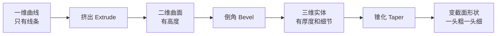
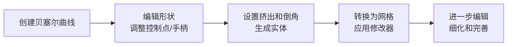

# **作为物体的曲线（Curve Object）**和**作为动画函数的F-Curve**。

这里重点讲解**曲线物体**，它是建模、动画、路径控制的核心工具。F-Curve会简要提及，帮你区分。
---
##  一、曲线物体 vs. F-Curve：别混淆
| 方面 | 曲线物体 (Curve Object) | F-Curve (动画曲线) |
| :--- | :--- | :--- |
| **本质** | 一种**物体类型**，用于建模、路径动画。 | 在**动画图表编辑器**中，用于控制属性随时间变化的曲线。 |
| **主要用途** | 创建路径、管道、文字、模型轮廓、动画路径。 | 控制动画的缓动、循环、节奏，是动画的核心。 |
| **所在位置** | 3D视图中，和网格、灯光等物体并列。 | **动画图表编辑器**（Graph Editor）中。 |
| **典型操作** | 编辑控制点、调整手柄、设置挤出和倒角。 | 添加关键帧、调整手柄、应用修改器。 |
> 💡 **简单记忆**：你用 `Shift+A` → **Curve** 创建的是**曲线物体**；你在**Graph Editor**里调整的是**F-Curve**。两者不同，但都重要。
---
##  二、曲线物体的类型与创建
Blender主要有两种曲线类型：
### 1. 贝塞尔曲线 (Bézier Curve)
- **特点**：通过**控制点**和**手柄**控制形状。手柄有**自由、对齐、矢量**等类型，决定曲线的平滑程度和尖角。
- **适用场景**：文字、Logo、简单路径、轮廓建模，是最常用的曲线类型。
### 2. NURBS 曲线
- **特点**：仅由**控制点**定义，曲线通过逼近这些点生成，更光滑但控制不够直观。
- **适用场景**：需要高度平滑的工业设计、有机形态（如汽车车身）。
### 创建方式
- **添加物体**：`Shift + A` → **Curve** → 选择 **Bezier** 或 **Path**（Path是预设的贝塞尔曲线）。
- **转换为曲线**：任何网格或文字物体可以在编辑模式下 `Alt + C` 转换为曲线，用于后续挤出或倒角。
---
##  三、曲线编辑模式：核心操作
进入编辑模式（`Tab`）后，曲线编辑与网格编辑类似，但有其特殊工具。
| 操作 | 快捷键/方法 | 说明 |
| :--- | :--- | :--- |
| **选择控制点/手柄** | 鼠标左键 | 选中后可进行移动、旋转、缩放。 |
| **移动/旋转/缩放** | `G` / `R` / `S` | 对选中的控制点或手柄进行变换。 |
| **调整手柄类型** | `V` | 快速切换手柄类型：自由、对齐、矢量、自动。 |
| **添加点** | `Ctrl` + `左键` | 在曲线上点击添加新控制点。 |
| **删除点** | `X` | 删除选中的控制点。 |
| **设置半径** | `Alt` + `S` | 调整点处的挤出宽度，用于制作锥形效果。 |
| **精确输入坐标** | 侧边栏 `N` → Transform | 可手动输入控制点的精确坐标。 |
> ⚠️ **注意**：曲线默认是**3D**的，手柄会随视角变化。如果发现挤出形状扭曲，尝试将曲线改为**2D**（属性面板中），2D曲线所有控制点在同一平面，挤出更规则。
---
##  四、曲线属性：让曲线变成实体模型
在曲线属性面板（物体数据属性）的 **Geometry** 部分，可以将一维曲线变成二维或三维实体。

### 核心属性解析
| 属性 | 作用 | 效果示例 |
| :--- | :--- | :--- |
| **Extrude（挤出）** | 沿曲线局部Z轴挤出，使曲线变成有宽度的带状物。 | 制作飘带、管道、简单的墙。 |
| **Bevel Depth（倒角深度）** | 为曲线挤出后的边缘添加倒角，使其有厚度。 | 制作圆管、有厚度的文字。 |
| **Bevel Resolution（倒角分辨率）** | 控制倒角的平滑度，值越高越圆滑。 | 低值为棱柱，高值为圆柱。 |
| **Taper Object（锥化物体）** | 使用另一条曲线来控制挤出形状的宽度变化。 | 制作锥形管道、变截面的模型。 |
| **Offset（偏移）** | 沿曲线法向偏移挤出形状，可用于制作管道壁厚。 | 制作双层管道、有厚度的壳。 |
> 💡 **关键技巧**：**曲线倒角**是建模中极实用的功能。你可以用一个圆形曲线作为倒角对象，制作出管道；用一个星形曲线，制作出异形管。
---
##  五、曲线的典型应用场景
### 1. 建模：管道、文字、Logo
- **管道**：创建一条贝塞尔曲线，在属性中设置 **Extrude** 和 **Bevel Depth**，即可生成管道。
- **文字**：添加文本物体，然后转换为曲线，即可挤出、倒角成3D文字。
- **Logo**：在矢量软件（如Inkscape）中绘制路径，导入Blender作为曲线，挤出成立体Logo。
### 2. 动画：路径动画
- 让物体沿曲线运动：选中物体，添加 **Follow Path** 约束，目标选择曲线，然后制作动画。
- 相机路径：创建一条曲线，让相机沿曲线移动，实现流畅的运镜。
### 3. 控制其他物体
- **曲线修改器**：让网格沿曲线变形，制作卷轴、弯曲的管道。
- **曲线引导**：用于粒子系统，让粒子沿曲线运动。
---
##  六、曲线建模快速入门流程
你可以尝试以下步骤，快速体验曲线建模：

1. **创建曲线**：`Shift + A` → Curve → Bezier。
2. **编辑形状**：按 `Tab` 进入编辑模式，用 `G`/`R`/`S` 调整控制点，用 `V` 切换手柄类型。
3. **挤出与倒角**：在曲线属性面板的 Geometry 中，调整 Extrude 和 Bevel Depth。
4. **转换为网格**：如果需要进一步雕刻或编辑，应用曲线修改器或 `Alt + C` 转换为网格。
---
##  七、曲线 vs. 网格：何时使用曲线？
| 特性 | 曲线物体 | 网格物体 |
| :--- | :--- | :--- |
| **优势** | 参数化、易修改、平滑、适合路径动画。 | 面数可控、适合精细雕刻、多边形建模。 |
| **劣势** | 难以进行精细的局部雕刻、复杂拓扑控制。 | 修改形状需进入编辑模式，对整体形状调整不如曲线方便。 |
| **适用场景** | Logo、文字、管道、轮廓、路径动画。 | 角色模型、道具、需要高细节的物体。 |
> 💡 **经验之谈**：在Blender中，**曲线和网格结合使用**是常见流程。先用曲线快速生成基础形状，然后转换为网格进行细节雕刻。
---
##  八、关于F-Curve（简要）
如果你在动画图表编辑器（Graph Editor）中看到曲线，那就是 **F-Curve**。它控制属性随时间的变化，是动画的核心。
- **功能**：定义动画的缓入缓出、循环、节奏等。
- **编辑**：在Graph Editor中，可以添加关键帧、调整手柄、应用修改器（如循环、平滑）。
- **与曲线物体的关系**：两者独立，但可以结合。例如，你可以用曲线物体控制物体位置，然后用F-Curve控制动画节奏。

📖 深入了解F-Curve修改器

  
F-Curve修改器类似物体修改器，为动画曲线添加非破坏性效果：
- **Cycles**：让动画循环。
- **Noise**：添加随机抖动。
- **Smooth**：平滑曲线。
- **Easing**：控制缓入缓出。
它们在动画中极为有用，可以快速创建复杂动画效果。

##  总结与建议
Blender的曲线是一个强大且参数化的工具，特别适合制作**平滑、规则、需要动画**的形状。建议你从以下步骤开始学习：
1.  **创建一条贝塞尔曲线**，熟悉控制点和手柄的操作。
2.  尝试 **挤出和倒角**，看看如何从线条变成实体。
3.  用曲线制作一个简单的**管道或文字**，体验参数化建模的便利。
4.  尝试将曲线转换为网格，进一步体会两者的区别和联系。
掌握曲线，能让你在建模和动画中多一种思维和工具，尤其是在处理需要流畅线条和路径动画的场景时，曲线几乎是不可或缺的。
