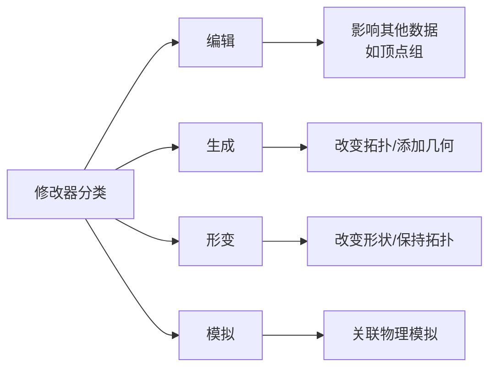
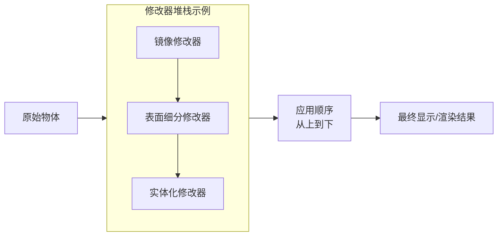
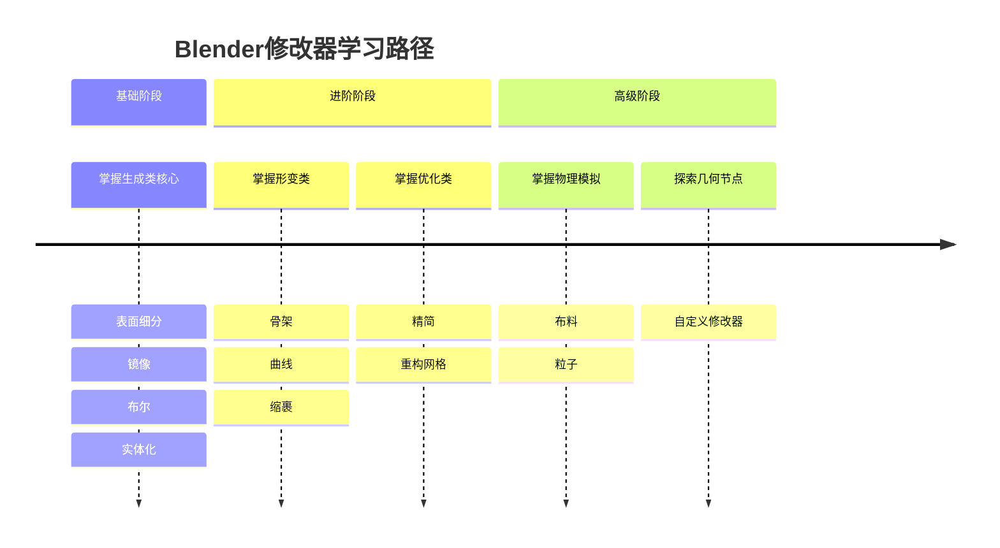

Blender的修改器（Modifiers）是其核心功能之一，它提供了**非破坏性的建模和动画效果**，能极大提升工作效率。下面我将系统性地介绍修改器的概念、分类、常用修改器及实用技巧。
###  一、核心概念：什么是修改器？
修改器是一种自动操作，以非破坏性的方式影响对象的几何形状。简单来说，它像一个“滤镜”，在不改变原始模型数据的情况下，实时生成新的几何效果。
**核心优势**：
*   **非破坏性**：随时可以调整参数或删除修改器，恢复原始模型。
*   **可堆叠**：可以为一个对象添加多个修改器，形成“修改器堆栈”，效果按顺序叠加。
*   **可控制**：大多数修改器支持通过顶点组、纹理等来限制影响范围。
**基本操作**：
*   **添加修改器**：在属性编辑器的“修改器”标签页，点击“添加修改器”或按 `Shift + A`。
*   **应用修改器**：点击修改器面板右上角的“应用”按钮，将效果永久固化到几何体上（此操作不可逆）。
*   **调整顺序**：修改器在堆栈中的顺序很重要，可以通过面板上的上下箭头调整。
###  二、修改器的四大类别
Blender的内置修改器主要分为四大类：

#### 1. 编辑（Edit）修改器
这类修改器通常不直接影响几何形状，而是影响其他数据，如顶点组。
*   **常用示例**：**数据传递**（Data Transfer）、**顶点权重编辑**（Vertex Weight Edit）等。
#### 2. 生成（Generate）修改器 
这是**最常用的一类**，它们能改变网格的拓扑结构，添加或修改几何形状。以下是最常用的一些：
| 修改器名称 | 核心功能 | 典型应用场景 |
| :--- | :--- | :--- |
| **表面细分 (Subdivision Surface)** | 对表面进行平滑细分，使模型更圆润。 | 角色建模、工业产品设计，是“平滑”建模的基石。快捷键 `Ctrl + 数字键`。 |
| **镜像 (Mirror)** | 沿指定轴对称复制模型。 | 建立对称模型（如角色、汽车），只需建模一半，另一半自动生成。 |
| **布尔 (Boolean)** | 与另一个物体进行并集、差集、交集运算。 | 快速挖孔、合并物体，是硬表面建模的核心工具。 |
| **实体化 (Solidify)** | 为表面添加厚度，将平面变成立体。 | 制作墙壁、外壳、衣服等有厚度的物体。 |
| **倒角 (Bevel)** | 为边缘创建倒角或圆角。 | 使锐边更真实，增强渲染效果。 |
| **阵列 (Array)** | 创建物体的副本，可按偏移或相对方式排列。 | 制作重复图案（如楼梯、栏杆）、环形阵列。 |
| **精简 (Decimate)** | 减少模型的多边形数量。 | 游戏模型优化、3D打印准备，降低网格复杂度。 |
| **重构网格 (Remesh)** | 基于体素重新构建网格，使拓扑均匀。 | 雕刻后重建均匀拓扑，为动画做准备。 |

了解更多生成修改器
*   **建形 (Build)**：逐渐“生长”出模型，可用于动画效果。
*   **拆边 (Edge Split)**：根据角度或标记的锐边，将网格拆分为多个面，用于平滑渲染。
*   **遮罩 (Mask)**：根据顶点组或纹理隐藏部分几何体，用于局部显示。
*   **螺旋 (Screw)**：将网格旋转并偏移，生成螺旋状物体（如螺栓、弹簧）。
*   **蒙皮 (Skin)**：为骨骼生成皮肉，常用于角色建模的初始阶段。

#### 3. 形变（Deform）修改器
这类修改器只改变物体的**形状和位置**，而不改变其拓扑结构。
| 修改器名称 | 核心功能 | 典型应用场景 |
| :--- | :--- | :--- |
| **骨架 (Armature)** | 用骨骼驱动网格变形，是角色动画绑定的核心。 | 角色动画、任何需要骨骼控制的物体。 |
| **曲线 (Curve)** | 使物体沿曲线变形，类似火车轨道。 | 制作管道、绳索、沿路径运动的物体。 |
| **缩裹 (Shrinkwrap)** | 将一个物体的表面投影到另一个物体上。 | 制作衣服紧贴身体、固定物体在另一物体表面。 |
| **简易形变 (Simple Deform)** | 提供弯曲、扭曲、锥化、拉伸等简单形变。 | 快速弯曲管道、扭曲物体。 |
| **晶格 (Lattice)** | 用一个笼子状的网格对物体进行整体形变。 | 整体调整模型轮廓，尤其适用于高面数模型。 |
| **置换 (Displace)** | 根据纹理或顶点组使表面产生凹凸起伏。 | 制作地形、皱纹、不规则表面。 |

📖 了解更多形变修改器
*   **铸型 (Cast)**：将物体形状调整为球形、圆柱形或立方体形。
*   **钩挂 (Hook)**：用空物体或骨骼来控制顶点位置，常用于动态控制。
*   **平滑 (Smooth)**：平滑顶点位置，减少表面噪点。
*   **波浪 (Wave)** | 在表面产生波浪形起伏，可用于动画。

#### 4. 模拟（Simulate）修改器
这类修改器与物理模拟相关，通常在启用粒子系统或物理时会自动添加，用于定义模拟在堆栈中的位置。
*   **常用示例**：**布料**（Cloth）、**碰撞**（Collision）、**爆破**（Explode）、**流体**（Fluid）、**粒子系统**（Particle System）等。
### ⚙️ 三、修改器堆栈与工作流程
修改器堆栈是理解修改器工作方式的关键。

**堆栈规则**：
1.  **顺序至关重要**：修改器从上到下依次应用。例如，先应用“镜像”再“表面细分”，结果会与先“表面细分”再“镜像”截然不同。
2.  **实时计算**：修改器的效果是实时计算的，在视图中直接可见（除非被隐藏）。
3.  **应用为最终步骤**：在确定不需要再调整参数后，可以“应用”修改器，将其效果固化到几何体上，以简化场景或导出。
> 💡 **最佳实践建议**：在堆栈中，通常将**镜像修改器**放在最上方（即堆栈底部），确保其他修改器（如细分、形变）在对称结果上工作。
###  四、学习路径与实用技巧
对于初学者，建议从以下核心修改器开始掌握：

**实用技巧**：
*   **使用顶点组控制范围**：许多修改器（如实体化、置换）可以通过顶点组精确控制影响区域。
*   **结合纹理使用**：置换、波浪等修改器可以加载纹理来创建更复杂的细节。
*   **善用“在编辑模式显示”**：开启修改器面板上的“在编辑模式显示”图标（顶点方块图标），可以在编辑模式下直接调整修改后的几何体，方便定位。
*   **利用几何节点扩展**：Blender允许通过几何节点创建自定义修改器，这是高级用户扩展功能的强大途径。
###  总结
修改器是Blender实现高效、非破坏性建模的核心工具。从简单的**表面细分**和**镜像**，到复杂的**布尔运算**和**物理模拟**，它们覆盖了建模、动画、物理等几乎所有领域。
**建议的学习方法**：
1.  先掌握最常用的几个生成修改器（表面细分、镜像、布尔、实体化）。
2.  在实际项目中尝试堆叠不同顺序的修改器，观察结果差异。
3.  遇到具体问题时，再查阅对应修改器的详细参数，逐步积累。
掌握修改器，你的Blender创作将如虎添翼。
