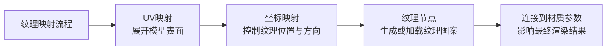
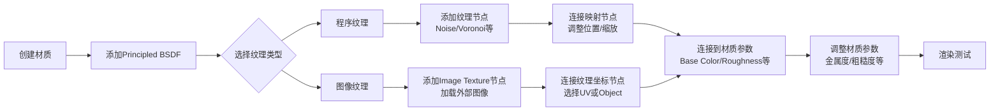

在Blender里，**材质（Material）** 和 **纹理（Texture）** 是让模型从“灰模”变成“真实物体”的核心。材质定义物体的表面属性（如颜色、光泽、粗糙度），而纹理则是用于控制材质参数的“图案”或“细节图”。下面我帮你系统梳理。
###  一、核心概念：材质 vs 纹理
| 方面 | 材质 (Material) | 纹理 (Texture) |
| :--- | :--- | :--- |
| **是什么** | 一个**数据块**，定义物体表面如何与光交互。 | 一个**图像数据**（或程序生成的图案），用于“驱动”材质的某个参数。 |
| **控制内容** | 整体颜色、金属度、粗糙度、透明度、法线等。 | 控制材质参数的**空间变化**，如颜色变化、凹凸细节、粗糙度分布等。 |
| **典型用途** | 定义“是金属还是塑料？”“是粗糙还是光滑？”。 | 制作“木纹”、“布料图案”、“表面划痕”、“毛孔细节”等。 |
| **关系** | **材质是容器，纹理是内容**。纹理需要连接到材质的某个输入上才能生效。 |
###  二、材质的核心：Principled BSDF 节点
在Blender中，90%的材质都从 **Principled BSDF** 节点开始。它是一个“万能节点”，整合了多种常见材质模型。
**关键参数及其对应的纹理控制**：
| 材质参数 | 作用 | 对应的纹理类型 |
| :--- | :--- | :--- |
| **Base Color** | 基础颜色 | 图像纹理（绘制或照片） |
| **Roughness** | 表面粗糙度 | 灰度图像（白=粗糙，黑=光滑） |
| **Metallic** | 金属度 | 灰度图像（白=金属，黑=非金属） |
| **Normal** | 表面凹凸细节 | 法线贴图（蓝紫色图像） |
| **Bump** | 高度差细节 | 灰度图像（模拟凹凸，效果不如法线） |
| **Displacement** | 真实的几何位移 | 灰度图像（需切换为置换模式） |
> 💡 **核心思路**：制作材质的过程，就是**为Principled BSDF的各个参数提供“输入”**。这些输入可以是纯色、程序纹理，或基于图像的纹理。
###  三、纹理的两大类型与创建方式
#### 1. 程序纹理（Procedural Texture）
由数学算法生成的纹理，无需外部图像。
- **优点**：无限分辨率、可参数化调整、文件小巧。
- **缺点**：效果有时不够自然，复杂效果节点树庞大。
- **常用节点**：Noise Texture（噪点）、Voronoi Texture（细胞）、Wave Texture（波浪）、Brick Texture（砖块）等。
#### 2. 图像纹理（Image Texture）
基于外部图片（如JPG、PNG）的纹理。
- **优点**：效果真实、可手绘、可照片拍摄。
- **缺点**：分辨率有限、需要额外文件、UV映射可能复杂。
- **来源**：自己绘制、拍摄、从网站下载（如Poly Haven、Quixel）。
###  四、纹理映射的三大核心概念
要让纹理正确“贴”在模型上，需要理解三个映射概念：

#### 1. UV映射（UV Mapping）
- **本质**：将3D模型表面“展开”成2D平面，让图像纹理有坐标依据。
- **操作**：在编辑模式下，选择模型 → 按 `U` → 选择展开方式（如“Smart UV Project”）。
- **关键**：UV展开的质量直接影响纹理是否变形。
#### 2. 纹理坐标（Texture Coordinates）
Blender提供多种坐标方式来控制纹理如何“包裹”模型：
- **UV Map**：最常用，基于UV展开。
- **Object**：基于物体自身坐标，适合程序动画。
- **World**：基于世界坐标，适合环境效果。
- **Camera**：基于相机视角，适合特殊效果。
#### 3. 映射节点（Mapping Node）
用于调整纹理的**位置、旋转、缩放**。通常连接在纹理坐标和纹理节点之间。
###  五、材质纹理制作工作流
以下是创建一个基础材质的典型流程：

#### 步骤详解：
1.  **创建材质**：
    - 在属性编辑器中点击“New”创建材质。
    - 切换到“Shading”布局，或拖动左侧边栏打开节点编辑器。
2.  **添加Principled BSDF**：
    - 在节点编辑器中，添加 `Shader > Principled BSDF` 节点。
3.  **添加纹理**：
    - 程序纹理：添加 `Texture > Noise Texture` 等节点。
    - 图像纹理：添加 `Texture > Image Texture` 节点，并加载图片。
4.  **连接映射与坐标**：
    - 添加 `Texture > Texture Coordinate` 和 `Vector > Mapping` 节点。
    - 将坐标节点输出（如UV）连接到映射节点的输入，再连接到纹理节点的矢量输入。
5.  **调整参数**：
    - 在Principled BSDF节点上调整基础参数。
    - 在纹理节点上调整细节参数（如噪点大小）。
6.  **测试与优化**：
    - 切换到渲染预览或按 `F12` 渲染。
    - 根据效果调整纹理参数或材质参数。
###  六、纹理绘制：亲手制作纹理
Blender内置 **Texture Paint** 模式，让你直接在3D模型上绘制纹理。
**操作流程**：
1.  确保模型已展开UV。
2.  在3D视口的模式菜单中选择“Texture Paint”。
3.  在属性编辑器中创建或选择材质和图像纹理。
4.  使用画笔工具在模型上直接绘制颜色。
**优点**：直观、适合绘制特定图案或颜色变化。**缺点**：不适合复杂材质（如粗糙度、法线），通常需要导出到图像编辑器进一步处理。
###  七、高级技巧与实用建议
1.  **使用节点组（Node Groups）**：将常用的纹理组合打包成节点组，提高复用性和效率。
2.  **混合纹理**：使用 `Mix` 节点混合多个纹理，制作复杂效果（如基础颜色 + 污渍 + 划痕）。
3.  **纹理烘焙**：将复杂材质烘焙成单张或多张纹理图像，用于导出或简化场景。
4.  **PBR纹理工作流**：从网站下载PBR纹理集（包含基础色、粗糙度、金属度、法线等），用 `Image Texture` 节点分别连接到Principled BSDF的对应参数上。
5.  **性能优化**：对于实时应用（如游戏），尽量使用单张贴图，并合理控制分辨率。
###  八、学习路径建议
对于初学者，我建议按以下顺序学习：
1.  **先理解材质**：掌握Principled BSDF的基本参数，用纯色材质做几个简单材质（金属、塑料、木头）。
2.  **再学程序纹理**：尝试用Noise、Voronoi等节点制作简单效果（如大理石、混凝土）。
3.  **学习UV展开**：掌握基本的UV展开方法，了解如何避免变形。
4.  **掌握图像纹理**：加载一张图像纹理，并正确连接到材质。
5.  **尝试纹理绘制**：使用Texture Paint模式在模型上直接绘制颜色。
6.  **进阶混合与烘焙**：学习如何混合纹理，以及如何烘焙纹理。
> 💡 **小贴士**：材质和纹理是Blender中实践性很强的部分。建议从简单场景（如一个立方体）开始，逐步尝试不同纹理组合，观察效果变化，这是最快的学习方式。
通过以上系统学习，你将能从“给模型上色”进阶到“为模型赋予真实感与细节”。如果在具体操作中遇到问题（如纹理接缝、节点连接错误），可以随时再问。
