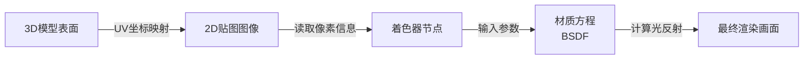

在 3D 建模和渲染领域，理清“贴图”与“材质”的关系是进阶的关键。很多初学者混淆这两者，是因为软件界面常常把它们放在一起。但从底层原理看，它们分属完全不同的层面。
核心逻辑可以概括为：**材质是“皮肤”，贴图是“纹身”，模型是“骨骼”。**
以下是详细的原理拆解：
### 一、 核心概念辨析
#### 1. 模型
模型定义了物体的**几何形态**（形状、体积）。
*   **原理**：由点、线、面组成的三维数据结构。
*   **局限**：它只解决了“物体是什么形状”，没有解决“物体表面长什么样”。一个球体模型，既可以是篮球，也可以是地球仪，区别就在于材质。
#### 2. 材质
材质定义了物体表面的**物理属性**（光学特性）。
*   **原理**：材质本质上是一组**数学方程**（Shader，着色器）。它告诉渲染引擎：“当光线照射到这个表面时，应该如何反射、折射或吸收。”
*   **核心参数**：它包含基础色、粗糙度、金属度、透明度等。这些参数通常是一个固定的数值（比如粗糙度 0.5）。
#### 3. 贴图
贴图是一张**二维图像**，用于打破材质参数的“单一性”。
*   **原理**：它是一张图片（如 JPG、PNG）。它的作用是**作为输入数据，替换掉材质中的某个固定参数**。
*   **举例**：如果不贴图，材质的“基础色”是纯红色；加了贴图，“基础色”就变成了图片上的图案。同理，贴图也可以控制“粗糙度”（哪里光滑、哪里粗糙）或“高度”（哪里凸起）。
---
### 二、 底层工作流：数据是如何流动的？
要理解它们如何配合，需要看数据流向。在现代 PBR（基于物理的渲染）工作流中，遵循以下逻辑：
1.  **建模阶段**：构建几何体。
2.  **UV 展开**：这是连接 3D 模型与 2D 贴图的桥梁。
    *   **原理**：就像剥桔子皮，把 3D 模型的表面展开成 2D 平面。每个顶点都会获得一个 UV 坐标，告诉计算机：“这个点对应贴图上的哪个像素。”
3.  **纹理绘制**：在 2D 平面（UV）上绘制细节，生成贴图文件。
4.  **材质连接**：在节点编辑器中，将贴图的像素值，赋给材质的参数。
**数据流图示：**

---
### 三、 深入解析：不同贴图的作用原理
理解贴图的原理，关键在于理解**“通道”**。一张 RGB 彩色图包含红绿蓝三个通道，黑白图（灰度图）只包含明度信息。
不同的贴图连接到材质的不同输入端，其工作原理如下：
#### 1. 漫反射/基础色贴图
*   **原理**：这是最直观的“颜色”。它定义了物体表面的固有颜色。
*   **数据类型**：RGB 彩色数据。
*   **作用**：告诉材质“哪里是什么颜色”。比如木头纹路、衣服图案。
#### 2. 粗糙度贴图
*   **原理**：控制表面微观的平整程度。
*   **数据类型**：灰度数据（黑白图）。
    *   **白色（数值 1.0）**：表示非常粗糙，光线打上去会向四面八方乱射（漫反射），看起来像哑光、石头。
    *   **黑色（数值 0.0）**：表示绝对光滑，光线会像镜子一样反射（镜面反射），看起来像金属、玻璃。
*   **作用**：通过一张黑白图，让物体表面有的地方光滑（如汗渍），有的地方粗糙（如皮肤纹理）。
#### 3. 金属度贴图
*   **原理**：定义材质是导体（金属）还是绝缘体（非金属）。
*   **数据类型**：灰度数据（通常只有黑或白，很少有中间值）。
    *   **白色**：金属。高光带有颜色（金色的金属高光也是金色）。
    *   **黑色**：非金属。高光通常是白色的（如塑料、木头）。
#### 4. 法线贴图 —— 重点难点
*   **原理**：这是一种**伪造几何细节**的技术。
*   **背景**：如果要在模型上做出凹凸细节（如皮肤毛孔、金属划痕），需要增加数以万计的面，电脑会卡死。
*   **解决方案**：模型表面保持平滑（低模），用法线贴图告诉计算机：“假装这里有个凹槽”。
*   **技术细节**：它利用 RGB 颜色信息（通常是偏蓝色）来修改表面的**法线方向**。法线决定了光的反射角度。虽然几何上没有凹槽，但光线的反射路径变了，视觉上看起来就是凹凸的。
*   **局限**：它只是视觉欺骗，边缘轮廓不会改变，阴影也是假的。
#### 5. 置换贴图
*   **原理**：与法线贴图不同，它是**真实改变几何形状**。
*   **机制**：根据贴图的灰度值，让模型的顶点真正发生位移。白的地方凸起，黑的地方凹陷。
*   **代价**：需要模型本身有足够的面数（细分曲面）才能生效，计算量大，但效果真实（有真实的阴影和轮廓）。
---
### 四、 总结：一句话理解
*   **模型**决定了物体的**轮廓**。
*   **UV**是物体表面的**坐标地图**。
*   **贴图**是根据 UV 坐标绘制的**数据图表**（记录颜色、光滑度、凸起程度等信息）。
*   **材质**是一个**处理器**，它读取贴图的数据，结合物理公式，计算出光线如何反射，最终呈现出你看到的画面。
在做桌面宠物项目时，你只需要遵循标准流程：**建模 -> UV 展开 -> 绘制贴图 -> 在着色器里把贴图连到对应接口**，就能得到正确的结果。
