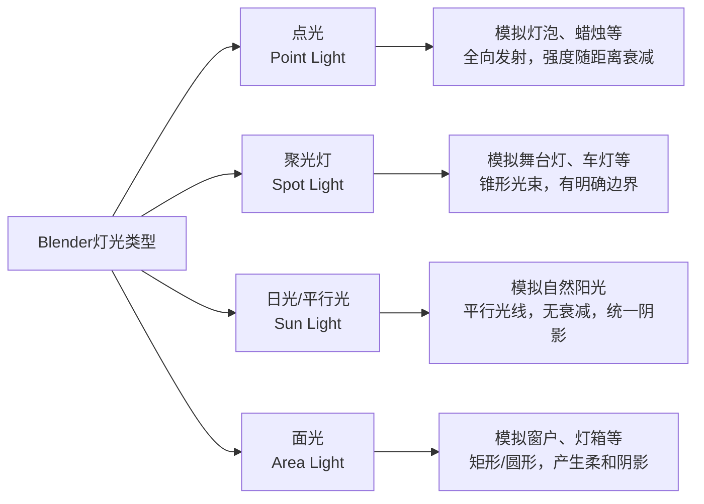
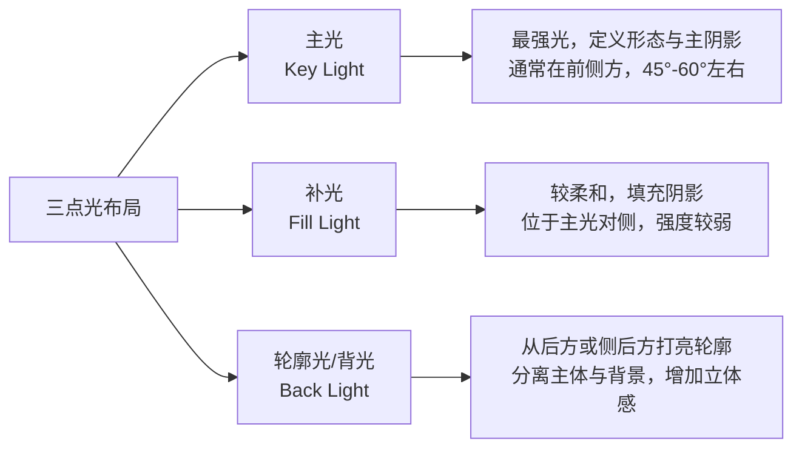

理解场景灯光是让作品从“模型堆砌”升级为“视觉作品”的关键一步。灯光不仅决定你看得见什么，更决定了画面的情绪、空间感和视觉焦点。
我们从基础到进阶，系统梳理 Blender 的灯光系统。
---
###  一、灯光的核心作用：为什么灯光如此重要？
灯光在 3D 场景中扮演多重角色，远不止“照亮物体”那么简单。
| 作用维度 | 具体体现 | 例子 |
| :--- | :--- | :--- |
| **塑造空间感** | 通过明暗对比、阴影投射，定义物体的体积和场景的深度。 | 一束侧光能让人像的五官立体，而非扁平一片。 |
| **引导视觉焦点** | 人类的视觉天然会被亮区域吸引。通过控制光照范围和强度，你可以决定观众先看哪里。 | 舞台聚光灯、产品展示中的局部高光。 |
| **营造氛围与情绪** | 不同的光质、颜色、方向能传递截然不同的情感。 | 温暖柔和的黄昏光 vs 冷硬清晰的办公室白光。 |
| **统一画面色调** | 灯光颜色（色温）与阴影颜色共同构成画面的色彩基调，影响整体氛围。 | 夕阳场景的暖色主光与冷色阴影补光。 |
---
###  二、Blender 中的灯光类型及其特性
Blender 提供四种基础灯光类型，每种都有其独特的“性格”和适用场景。

#### 1. 点光
*   **特性**：从一个点向所有方向均匀发射光线，强度随距离衰减（符合平方反比定律）。
*   **适用**：模拟真实的灯泡、蜡烛、火把等点光源。也常作为补光，因为它容易控制范围。
*   **关键参数**：
    *   **衰减**：控制光线强度随距离减弱的方式（如线性、平方反比等），影响光照范围。
    *   **阴影**：可以产生柔和的阴影，阴影边缘的模糊程度取决于灯光尺寸。
#### 2. 聚光灯
*   **特性**：光线集中在一个锥形范围内，形成明确的光束和光斑。边缘可以非常锐利。
*   **适用**：模拟舞台聚光灯、手电筒、车灯、探照灯等。也用于创造强烈的视觉焦点。
*   **关键参数**：
    *   **光斑形状**：可以是圆形或方形（如光幕）。
    *   **光斑柔和度**：控制光斑边缘的过渡是生硬还是柔和。
    *   **显示锥形**：在视口中显示光锥范围，方便调整。
#### 3. 日光
*   **特性**：模拟来自无限远处的平行光线，如太阳。**没有衰减**，光线强度恒定。
*   **适用**：自然日光场景，定义场景的主光源和主阴影方向。
*   **关键参数**：
    *   **强度**：控制整体亮度。
    *   **角度**：控制阴影的边缘柔和度。角度越大，阴影越柔和（模拟阴天或大太阳）。
*   **注意**：日光通常与 **世界环境** 中的 **天空纹理** 或 **HDRI** 配合使用，共同构成自然光照。
#### 4. 面光
*   **特性**：从一个矩形或圆形区域发射光线，产生非常柔和、自然的阴影。
*   **适用**：模拟窗户光、灯箱、柔光箱等大面积光源。是人像、产品摄影布光的首选。
*   **关键参数**：
    *   **尺寸**：直接决定阴影的柔和程度。面积越大，阴影越柔和。
    *   **形状**：矩形、圆形、椭圆等，影响光斑形状。
---
###  三、灯光核心参数详解
无论哪种灯光，都有几个核心参数共同决定最终效果。
| 参数 | 作用 | 影响 |
| :--- | :--- | :--- |
| **颜色** | 决定灯光的色温。 | 暖色（如橘黄）营造温馨感，冷色（如蓝白）营造科技感或夜晚感。 |
| **强度** | 控制灯光的功率。 | 直接决定亮度。注意，在 Cycles 中，强度需要合理设置，否则可能过曝或能量不守恒。 |
| **衰减** | 控制光照范围。 | 可以让灯光只影响特定区域，避免照亮整个场景。常用于补光。 |
| **阴影** | 决定是否投射阴影及阴影质量。 | 是塑造空间感的关键。阴影的柔和度由灯光大小决定，锐度由灯光类型和距离决定。 |
| **光程** | 控制灯光与其他物体的交互。 | 可以让灯光只对某些物体可见，或只影响漫反射/高光等，用于精细控制。 |
> 💡 **关键提示**：在 Cycles 中，灯光强度单位更接近物理真实。你可能会发现同样的强度，在 Eevee 和 Cycles 中亮度差异很大。这是正常的，因为 Cycles 是基于物理的渲染。
---
###  四、布光基本原则与经典布局
有了工具，还需要策略。以下是布光的核心原则和经典方法。
#### 1. 核心原则
*   **明确主光与补光**：场景中通常需要一个主要光源（主光）定义整体形态和主阴影，一个或多个补光填充阴影区域，控制光比。
*   **有光必有影**：不要害怕阴影。合理的阴影是塑造体积的关键。通常，你需要控制阴影的浓淡和方向。
*   **遵循物理规律**：除非有特殊创作意图，否则应遵循光源方向一致（如日光从同一方向来）、阴影方向一致等物理规律。
*   **使用参考**：多观察现实世界或优秀影视、摄影作品的光照，分析其光源位置、类型和光比。
#### 2. 经典布光：三点光
这是摄影和电影中最基础的布光方案，用于塑造主体。

**应用步骤**：
1.  **放置主光**：首先放置一个日光或面光，模拟主要光源，从侧前方照亮主体。调整强度和位置，直到形成漂亮的主阴影。
2.  **添加补光**：在主光对侧，添加一个强度较弱、更柔和的点光或面光，填充面部阴影，降低光比。注意不要破坏主光的方向感。
3.  **添加轮廓光**：在主体后方或侧后方，添加一个聚光灯或面光，打亮头发、肩膀轮廓，创造亮边，将主体从背景中“拉”出来。
---
###  五、实际应用与进阶技巧
#### 1. 自然光场景
1.  **使用日光作为主光**：设置日光，模拟太阳角度。
2.  **配合世界环境**：在 `世界属性` 中，使用 **天空纹理** 或 **HDRI 贴图**。HDRI 可以提供真实的环境光和反射，让日光场景更自然。
3.  **补光**：如果日光造成阴影过深，可以添加一个面光或点光，模拟天空散射光，作为补光。
#### 2. 室内场景
1.  **使用面光模拟窗户**：在窗户位置放置一个面光，尺寸与窗户相近，颜色可以略暖（模拟室内反射）。
2.  **使用点光模拟室内灯源**：在灯泡位置放置点光。
3.  **利用反弹光**：在 Cycles 中，可以开启间接光计算，让光线在墙壁间反射，照亮阴影区域，效果更自然。
#### 3. 产品与静物展示
1.  **追求柔和均匀的光照**：通常使用多个大面积面光（柔光箱），包围物体。
2.  **强调质感**：使用条形面光或聚光灯，以掠射角度打亮物体边缘，突出表面纹理。
3.  **严格控制光斑**：使用聚光灯的衰减功能，确保只照亮产品本身，不干扰其他物体。
#### 4. 进阶技巧
*   **灯光分组与渲染层**：在复杂场景中，可以将不同灯光分配给不同渲染层，后期单独调整。例如，将背景光和人物光分开。
*   **光程**：使用灯光的“光程”设置，可以让某个灯光只影响漫反射，不影响高光，用于创造特殊效果或避免灯光穿模。
*   **IES 文件**：可以加载 IES 光度文件，让灯光具有真实的强度分布和光斑形状，常用于建筑可视化。
---
###  六、与渲染引擎的交互：Eevee vs Cycles
| 特性 | Eevee | Cycles |
| :--- | :--- | :--- |
| **灯光计算** | 实时近似，效率高 | 基于物理，计算精确 |
| **阴影** | 可能需要手动设置阴影立方体，有时会出现瑕疵 | 自动计算，非常准确，但可能需要更多采样 |
| **全局光照** | 有限，需要间接光设置或假反射 | 完整的间接光计算，光线自然反弹 |
| **灯光强度** | 相对随意，可以快速出效果 | 需要更符合物理的强度设置，注意曝光 |
| **适用场景** | 实时预览、动画、游戏、风格化渲染 | 最终产品级渲染、影视、高精度静帧 |
**建议**：先用 Eevee 快速调整灯光构图和基础效果，最终渲染时切换到 Cycles 进行高质量输出。两者可以互相参考，但要注意在 Cycles 中重新检查曝光和灯光强度。
---
###  七、常见问题与优化
1.  **场景过曝或曝光不足**
    *   **检查**：渲染设置中的曝光（Exposure）和灯光强度。
    *   **解决**：合理调整灯光强度，或使用相机曝光控制。在 Cycles 中，注意使用“胶片感光度”等设置。
2.  **阴影出现噪点**
    *   **原因**：在 Cycles 中，阴影区域采样不足。
    *   **解决**：增加渲染采样，或使用降噪。也可以适当增加灯光尺寸，使阴影更柔和，减少计算难度。
3.  **灯光穿模（如照亮不该亮的物体）**
    *   **解决**：使用灯光的“衰减”设置限制光照范围，或使用“光程”设置排除特定物体。
4.  **Eevee 中灯光阴影看起来奇怪**
    *   **解决**：在 Eevee 的渲染设置中，检查“阴影”部分，调整阴影立方体尺寸和偏移。有时需要手动调整阴影立方体以匹配灯光。
5.  **渲染时间过长**
    *   **优化**：减少不必要的灯光，尤其是开启柔和阴影的面光和点光。使用简化视图显示，在最终渲染时再开启所有灯光。
---
###  总结与学习路径
掌握灯光是一个需要观察和实践的过程。建议的学习步骤：
1.  **理解基础**：用日光、点光、面光分别照亮一个简单模型（如球体），观察阴影和效果区别。
2.  **实践三点光**：给一个角色或静物布置三点光，体会主光、补光、轮廓光的作用。
3.  **模仿现实**：找一张照片或电影截图，尝试在 Blender 中还原其灯光布局。
4.  **探索世界环境**：学习使用 HDRI 贴图和天空纹理，体会它们与日光灯光如何配合。
5.  **尝试不同情绪**：用同一场景，通过调整灯光颜色、强度和位置，创造温馨、恐怖、科幻等不同氛围。
灯光是技术与艺术的结合，它没有唯一的标准答案，但遵循物理规律和视觉原理的练习，能让你更快地找到最适合你场景的“光”。
