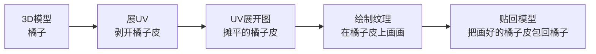
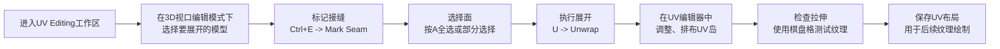
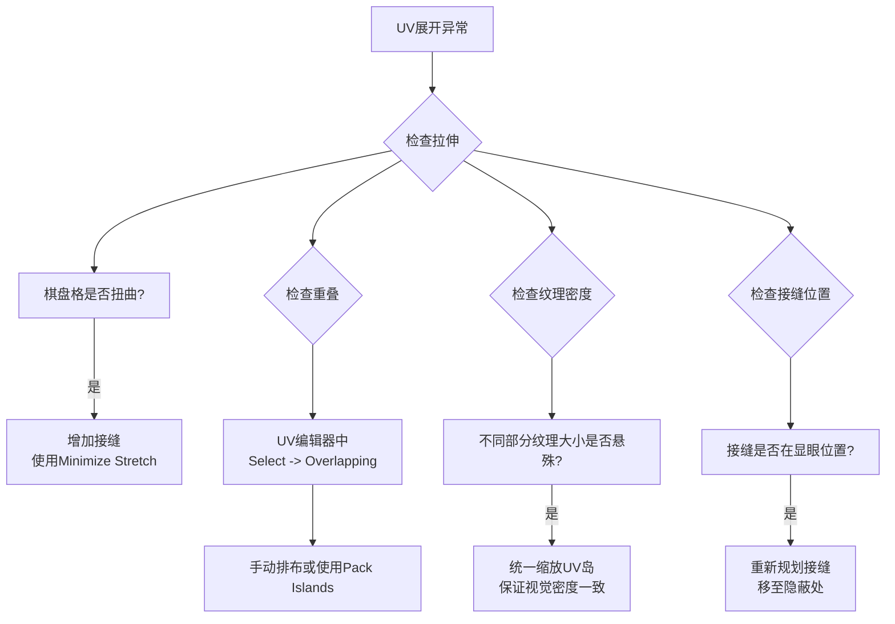

**展UV（UV Unwrapping）** 就是把3D模型的表面“剪开”并摊平成一张2D平面图的过程。这样，你就可以在2D软件里（或Blender内部）为它绘制纹理贴图，然后再准确“贴”回3D模型上。
下面用一个类比帮你快速理解核心原理，然后再展开细节。

---
##  一、核心原理：为什么需要“展UV”？
### 1. 问题：3D表面无法直接画图
计算机里的图像是**2D平面**（有长宽，XY坐标），但3D模型表面是**曲面**。你没法直接在曲面上“画”图，因为画笔和画布维度都不一样。
### 2. 解决：建立“3D点 ↔ 2D点”的映射关系
**UV映射（UV Mapping）** 就是给3D模型的每个顶点，在2D平面上找一个对应的“点”。
*   **3D空间**：用 **X, Y, Z** 坐标表示。
*   **2D纹理空间**：用 **U, V** 坐标表示（所以叫UV，而不是XY）。
每个3D顶点都有对应的UV坐标，定义了纹理图像上的哪个点对应这个3D点。**展UV，就是为每个顶点计算这些UV坐标的过程。**
### 3. 形象类比：橘子皮
*   **3D模型** = 一个橘子。
*   **展UV** = 小心翼翼地把橘子皮完整地剥下来，摊平在桌面上。
*   **UV展开图** = 摊平后的橘子皮（可能被剪成几块）。
*   **绘制纹理** = 在摊平的橘子皮上画画、贴纸。
*   **应用纹理** = 把画好的橘子皮再小心地包回橘子，纹理就完美贴合了。
---
##  二、关键概念与术语解释
理解这些，你就掌握了UV展开的“语言”。
| 术语 | 解释 | 比喻 |
| :--- | :--- | :--- |
| **UV坐标** | 2D纹理平面上的点，对应3D模型上的顶点。 | 橘子皮上每个点的“地址”。 |
| **UV岛** | 展开后，互不相连的UV块。一个模型可能有多个UV岛。 | 剥橘子时，剥下的一片片完整的橘子皮。 |
| **接缝** | 你手动指定的“剪开”边，UV展开时模型会从这里“剪开”。 | 用刀划橘子皮时，划开的切口。 |
| **拉伸** | UV展开后，某些区域被“拉扯”变形，导致纹理会被拉伸变形。 | 橘子皮摊平时，某些地方被强行扯薄了，画上去的图案会变扁。 |
| **重叠** | 两个不同的UV岛或部分重叠在一起，导致纹理互相干扰。 | 两片橘子皮重叠在一起，画图时会互相遮挡。 |
| **UV密度** | 单位面积内UV面的数量。密度一致，纹理大小才均匀。 | 橘子皮的“纹路密度”要均匀，否则画出的格子大小不一。 |
---
##  三、在Blender中如何展UV？标准流程
Blender提供了专门的**UV Editing**工作区，流程高度标准化。

### 步骤详解
#### 1. 准备模型
*   确保模型已经**完成基本建模**，且**应用了缩放和旋转** (`Ctrl+A` -> Apply Scale/Rotation)。
*   模型**尽量不要有太多重叠面或内部面**，否则UV展开会出问题。
#### 2. 进入UV编辑环境
*   在顶部菜单栏，选择 **UV Editing** 工作区。这会为你分割视图：左边是**UV编辑器**，右边是**3D视口**。
#### 3. 标记接缝（关键步骤）
*   在3D视口中，进入**编辑模式 (`Tab`)**，选择**边选择模式 (`2` 或点击图标)**。
*   **选中希望模型“裂开”的边**。通常选择：
    *   模型本身的**结构边**（如建筑墙角、武器边缘）。
    *   **不明显的隐蔽边**（如角色背部、手臂内侧）。
*   按 `Ctrl+E` -> 选择 **Mark Seam**（标记接缝）。这些边会变成红色高亮。
#### 4. 执行UV展开
*   在3D视口中，**选择要展开的面**（通常 `A` 全选，或根据需要部分选择）。
*   按 `U` 键，选择 **Unwrap**（展开）。
*   Blender会根据你标记的接缝，计算UV展开并显示在左侧的UV编辑器中。
#### 5. 检查与调整UV
*   **使用棋盘格纹理检查**：在UV编辑器中，新建一个**UV Grid**或Color Grid图像，在着色器编辑器中将其连接到模型，在3D视口中查看。
    *   棋盘格应该**尽量呈正方形**，如果被拉成长方形或扭曲，说明有拉伸。
*   **调整UV岛**：在UV编辑器中，你可以移动、旋转、缩放、排布UV岛，使其更合理。
*   **使用“Pack Islands”工具**：在UV编辑器中，选择所有岛，然后使用 **UV -> Pack Islands**，可以自动紧凑地排布所有UV岛，节省纹理空间。
---
##  四、展UV的核心目标与原则
**展UV的目标不是“展开”，而是“为纹理绘制和表现服务”。** 好的UV布局能让后续工作事半功倍。
### 1. 最小化拉伸与变形
这是最重要的原则。
*   **拉伸会导致纹理变形**，棋盘格测试时方格变成长方形或菱形就是拉伸。
*   **解决方法**：
    *   **多标记接缝**：将模型“剪”成更多小块，每块展开更容易平展。
    *   **使用“Minimize Stretch”工具**：在UV编辑器中，选择岛后使用 **UV -> Minimize Stretch**，可以自动减轻拉伸。
### 2. 避免UV重叠
*   重叠会导致纹理在同一位置绘制多次，结果不可控。
*   **检查方法**：在UV编辑器中，使用 **Select -> Overlapping** 可以快速选中重叠的岛。
### 3. 合理利用纹理空间
*   UV岛应该尽量紧凑地排列，减少空白，提高纹理分辨率利用率。
*   通常，**重要、细节多的区域（如角色面部、主体结构）应占更大面积**。
### 4. 考虑纹理绘制与后续流程
*   **接缝位置**：接缝应尽量安排在**模型上不明显、不易被看到的位置**（如头顶、腋下、脚底），因为接缝处纹理可能有接缝。
*   **UV岛布局**：尽量将相关部分放在相近位置，方便绘制。例如，角色的身体UV可以按躯干、四肢、头部分区。
---
##  五、常见问题与解决清单
> 💡 **遵循这个检查清单，能解决90%的UV问题。**

**经典问题与解决**：
*   **纹理看起来模糊或拉伸**：通常是UV有拉伸或密度不均。使用棋盘格检查并调整。
*   **模型上有奇怪的黑色或接缝**：可能是接缝处UV没有对齐，或者纹理本身没有处理接缝（如在Substance Painter中需要使用“Tri-planar”投影）。
*   **烘焙（如AO、法线）出现黑斑或错误**：通常是因为UV重叠或拉伸，导致烘焙时射线计算错误。
*   **在游戏引擎中纹理看起来不正确**：检查颜色空间是否正确（BaseColor用sRGB，Normal、Roughness等用Non-Color）。
---
##  六、不同类型模型的UV策略
不同模型的展UV策略不同，核心是“因模型而异”。
| 模型类型 | UV策略 | 注意要点 |
| :--- | :--- | :--- |
| **硬表面（机械、道具）** | 多使用**清晰的结构边作为接缝**，UV岛尽量规整。 | 避免在圆形表面（如枪管）上强行拉直，可以接受一定弧度。 |
| **角色/生物** | 通常需要**多个UV岛**（如头、躯干、四肢、手），接缝安排在身体隐蔽处。 | 必须保证面部、手部等重要区域有足够的UV密度。 |
| **建筑/场景** | 可能使用**重叠UV**（如重复的窗户、地板），以节省纹理空间。 | 但烘焙光照贴图时，**不能有重叠**，否则会烘焙错误。 |
| **低模/游戏资产** | UV效率至关重要，需要紧凑排布，可能使用**光照贴图UV**（第二套UV）。 | 游戏引擎常为光照烘焙生成第二套UV，需要无重叠、均匀。 |
---
##  七、进阶技巧与工具
1.  **使用“Seams from Islands”**：如果你已经有UV展开，可以使用 **UV -> Seams from Islands** 自动生成接缝，反向操作。
2.  **利用“Project from View”**：对于简单平面（如地形、旗帜），可以使用 `U` -> **Project from View**，从视角直接投影UV，非常快捷。
3.  **使用插件辅助**：Blender有很多UV辅助插件，如：
    *   **TexTools**：集合了多种UV编辑、检查工具。
    *   **UV Packmaster**：第三方强大的UV打包插件。
4.  **多次迭代**：不要期望一次就展好。通常需要**反复调整接缝和展开**，才能得到满意结果。
---
##  总结：展UV是“技术+艺术”的结合
*   **技术层面**：它是一套严格的映射计算，需要你理解几何、拉伸、密度等概念。
*   **艺术层面**：它要求你像画地图一样规划，考虑纹理绘制流程、视觉效果和最终表现。
**记住**：**展UV是为纹理服务的，好的UV布局能让绘制纹理变成享受，坏的UV布局则会让后续每一步都痛苦。** 所以，多练习，用不同的模型尝试，理解其中的权衡，是掌握UV展开的关键。
