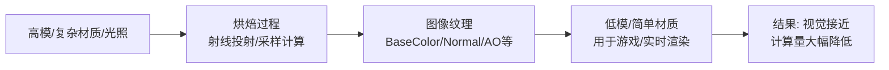
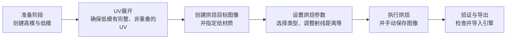
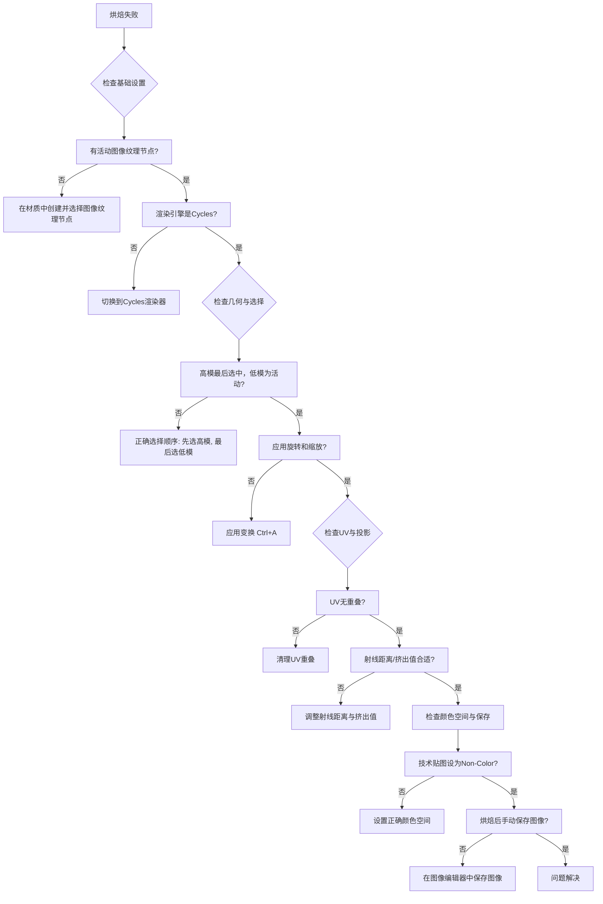

Blender 的烘焙（Baking）是**将复杂的光照、材质、几何细节“冻结”成图像纹理**的过程，核心目的是**在保持视觉效果的同时，大幅降低实时渲染的计算负担**。下面我将从原理、类型、流程、注意事项到常见问题，为你系统梳理。
---
### 一、核心原理：为什么需要烘焙？
其本质是**用空间换时间，用纹理替代计算**。

**工作原理（以“高模→低模”烘焙为例）**：
1.  **射线投射**：从低模表面向外发射射线，检测与高模表面的交点。
2.  **信息采样**：根据烘焙类型（如法线、曲率、光照），在交点处采集高模的几何或材质信息。
3.  **图像存储**：将采集的信息按UV映射写入一张图像。
因此，烘焙的成功高度依赖**UV、几何关系、材质设置和烘焙参数**的准确性。
---
### 二、主要烘焙类型与应用场景
Blender 支持多种烘焙类型，需根据目标选择。
| 烘焙类型 | 烘焙内容 | 典型用途 |
| :--- | :--- | :--- |
| **Combined** | 所有材质、光照（除高光和SSS） | 创建游戏光照贴图（Lightmap），预计算全局光照。 |
| **Ambient Occlusion (AO)** | 环境光遮蔽信息 | 为低模添加细节阴影，减少实时计算AO的开销。 |
| **Normal** | 高模表面细节法线信息 | 将高模的凹凸细节“转印”到低模，是游戏资产烘焙的核心。 |
| **Diffuse** | 基础颜色（Albedo） | 获取高模的纯颜色，**需注意关闭光照影响**以避免烘焙灯光。 |
| **Roughness / Metallic** | 粗糙度/金属度数据 | 用于PBR流程，需设置为“Non-Color”颜色空间。 |
| **Emission** | 自发光颜色 | 常用于将高模的金属度等数据通过自发光通道烘焙出来。 |
| **Displacement** | 置换信息 | 用于创建真正的几何位移，需高精度（16位或32位）图像。 |
---
### 三、完整烘焙流程（以高模→低模为例）
遵循一个清晰的流程是避免错误的关键。下图概括了核心步骤：

#### 1. 准备几何体
*   **高模**：包含所有细节的模型（雕刻、高面数模型）。
*   **低模**：面数低、UV已展开的模型。**UV必须无重叠**，否则烘焙信息会相互干扰。
*   **位置关系**：高模与低模需完全重合，且**低模的缩放值必须为1**（应用缩放：`Ctrl+A` -> 应用缩放）。
#### 2. 设置烘焙目标
1.  在UV编辑器或图像编辑器中，新建一张图像作为烘焙目标。
2.  在低模的材质中，添加一个 **“图像纹理”节点**，并选择新建的图像。**此节点必须为活动节点**（最后选中）。
3.  若对象有多个材质槽，**每个需要烘焙的材质都必须包含该图像纹理节点**。
#### 3. 配置烘焙参数
在渲染属性面板的“烘焙”区域设置：
*   **渲染引擎**：必须选择 **Cycles**。
*   **烘焙类型**：根据需求选择（如Normal）。
*   **影响**：例如烘焙Diffuse时，需**取消勾选“Direct”和“Indirect”**，否则会烘焙入光照。
*   **选定到活动**：勾选此项，表示从选中的高模烘焙到活动的低模上。**选择顺序**：先选高模，最后选低模。
*   **射线距离与挤出**：这是控制投影的关键参数（见下节详解）。
#### 4. 执行烘焙与保存
点击“烘焙”按钮。完成后，**必须手动在图像编辑器中保存图像**（`图像 -> 另存为`），否则关闭Blender后数据会丢失。
---
### 四、关键参数详解与注意事项
#### 1. 射线距离与挤出（核心投影控制）
这通常是新手最困惑的地方，也是烘焙失败的主因之一。
*   **原理**：Blender从低模表面沿法线方向发射射线，检测高模。如果低模在高模内部，或距离过远，射线可能无法正确交点。
*   **调整策略**：
    1.  先将**挤出**设置为一个较小值（如0.01），逐渐增大，直到低模完全包裹高模（可视化可开启“在视口中显示射线”）。
    2.  **最大射线距离**通常设为 **1.5倍 - 2倍的挤出值**，防止射线误打到远处其他物体。
*   ** cages（笼）**：对于复杂模型（重叠、缝隙、薄壁），使用笼（一个稍微扩大低模的副本）能提供更精确的投影控制。
#### 2. UV与边缘留白（Margin）
*   **UV重叠**：UV岛不能重叠，否则烘焙信息会错乱。
*   **边缘留白**：为防止Mipmap在远处产生接缝，UV岛之间需留出像素边距。烘焙设置中的“边距”参数可自动扩展边缘像素。
#### 3. 颜色空间与文件格式
这是技术性细节，直接影响最终效果。
| 贴图类型 | 颜色空间 | 说明 |
| :--- | :--- | :--- |
| **BaseColor/Diffuse** | sRGB | 标准颜色纹理。 |
| **Normal, Roughness, Metallic, AO, Displacement** | **Non-Color** | 这些是数据图，不是可视颜色。若使用sRGB，会导致引擎中计算错误。 |
| **高精度数据（如Displacement）** | 16位或32位 | 避免色阶断层，保留平滑过渡。 |
#### 4. 模型与材质检查
*   **应用变换**：烘焙前，对高模和低模**应用旋转和缩放**（`Ctrl+A` -> 应用旋转/缩放），否则会导致投影错误。
*   **法线方向**：确保所有面朝外（视图叠加层中，蓝色为外，红色为内）。错误法线会导致黑斑或细节丢失。
*   **材质简化**：若烘焙结果异常，可尝试简化高模材质，排除复杂节点干扰，定位问题。
---
### 五、常见问题与解决清单
> 💡 **遵循一个可靠的检查清单**，能解决90%的烘焙问题。

**经典错误与解决**：
*   **结果全黑**：检查是否有活动图像纹理节点、烘焙类型是否正确、是否开启了“到活动”但未选择高模。
*   **细节丢失/有黑斑**：射线距离太小或太大，调整挤出和最大射线距离。检查法线是否翻转。
*   **UV接缝处有亮线**：增加边缘留白（Margin）值。
*   **在游戏引擎中看起来不对**：检查颜色空间是否正确，特别是法线和粗糙度贴图是否设为Non-Color。
*   **烘焙后图像未保存**：养成习惯，烘焙后立即在图像编辑器中保存。
---
### 六、总结与最佳实践
烘焙是3D艺术家，特别是游戏美术的**核心技能**。掌握它需要理解其**基于射线投射的原理**，并建立**严格的流程习惯**。
**核心原则**：
1.  **几何是基础**：确保模型干净、变换已应用、法线正确。
2.  **UV是画布**：确保UV无重叠、有足够边距。
3.  **设置是关键**：理解并正确设置射线距离、颜色空间、烘焙类型。
4.  **流程是保障**：遵循“准备-UV-目标-设置-烘焙-保存”的固定流程，避免跳步。
通过以上系统梳理和反复实践，你能将烘焙从“随机故障的黑箱”转变为“可靠可控的生产环节”。
