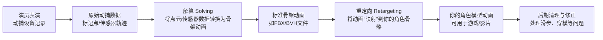

**动捕（动作捕捉）** 是一种记录真实演员表演并将其转换为数字运动数据的技术。**模型动作** 是指3D角色模型本身的“表演”，由内部的骨骼系统驱动，通过蒙皮让表面网格产生变形。两者的结合过程，核心是**“重定向（Retargeting）”**——将动捕数据“搬运”到你的角色骨骼上，并修正因比例差异等问题产生的瑕疵。
下面我们拆解开来说。
---
##  一、先搞清楚两个概念
### 1. 什么是“动捕”（Motion Capture）？
**本质**：**记录真实运动的数据**。
**工作流程**：
1.  演员穿戴带有标记点（Markers）或传感器的特制服装。
2.  动捕系统（光学、惯性等）实时追踪这些标记点/传感器的空间位置和旋转。
3.  系统将原始信号转换为**数字运动数据**，通常存储为FBX、BVH等格式。
**产出**：一个**“虚拟骨架”** 的动画数据——一系列关键帧，描述了每一根骨骼在每一帧的旋转、位置和缩放。但这个骨架和你的角色模型通常并不一样。
> 💡 **关键**：动捕数据本身**不包含任何模型**，它只是一段“运动轨迹”，可以应用到任何兼容的骨架上。
### 2. 什么是“模型动作”（Character Animation）？
**本质**：**由骨骼驱动、通过蒙皮实现的模型变形**。
它依赖于两个核心步骤：
| 步骤 | 说明 |
| :--- | :--- |
| **绑定（Rigging）** | 为模型创建一套**数字骨骼（骨架）**，并添加控制器，让动画师可以方便地操作。 |
| **蒙皮（Skinning）** | 将模型的网格顶点与骨骼关联起来，为每个顶点指定受哪些骨骼影响以及影响的强度（权重）。当骨骼移动时，网格随之变形。 |
**结果**：当你旋转骨骼的关节时，角色的手臂、腿部等表面网格会相应弯曲，产生动画。
---
##  二、两者如何结合？核心流程：解算 → 重定向
动捕数据要变成你模型的动画，必须经过**两个关键步骤**：**解算（Solving）** 和 **重定向（Retargeting）**。

### 1. 解算（Solving）：从“点云”到“骨架动画”
动捕系统直接输出的，是演员身上各个标记点的空间轨迹（一个移动的“点云”）。解算的过程，就是在这个“点云”中**“重建”出一个虚拟骨架**，并让它跟随点云运动，从而生成骨骼动画。
*   **比喻**：就像在演员身上布满灯泡，然后拍摄这些灯泡的运动轨迹。解算就是根据这些灯泡的轨迹，反向推导出一个“骨架人”的姿势，并记录下来。
### 2. 重定向（Retargeting）：从“演员骨架”到“你的角色骨架”
这是结合的关键环节。演员的骨架（源骨架）和你角色的骨架（目标骨架）几乎总是不同的：骨骼命名、层级、骨骼长度、肢体比例都可能不同。重定向就是将动画数据从源骨架**“翻译”** 到目标骨架上。
**核心挑战**：
*   **比例不匹配**：演员臂展和角色不同，可能导致手部穿模或悬空。
*   **骨骼层级差异**：角色可能多或少一根脊椎骨。
*   **IK/FK差异**：动捕数据可能用FK（前向动力学）解算，而你的角色用IK（反向动力学）控制脚部固定，这会导致“膝盖翻转”等问题。
**解决方案**：
*   **引擎内置重定向**：如UE5的IK Retargeter或Unity的Humanoid系统，会自动处理很多比例问题。
*   **手动调整**：在Blender、Maya等软件中，通过插件或手动调整骨骼映射来修复。
---
##  三、实际结合流程（以游戏为例）
一个典型的游戏动捕到角色动画的流程如下：
### 步骤1：获取动捕数据
可以找专业动捕公司提供，或使用一些动捕库（如Mixamo）的动画资源。
### 步骤2：准备你的角色模型
1.  **建模**：完成角色模型。
2.  **绑定（Rigging）**：为模型创建一套符合标准人形规范的骨架（如UE/Unity的Humanoid规范）。
3.  **蒙皮（Skinning）**：刷好权重，确保变形自然。
### 步骤3：导入动捕数据到软件中
在Blender、Maya或MotionBuilder中导入动捕数据（FBX/BVH）。这会创建一个或多个骨架动画。
### 步骤4：重定向动画到你的角色骨架
*   **使用引擎重定向**：将动捕骨架和你的角色都导入UE5，使用 **IK Retargeter** 设置源骨架和目标骨架，系统会自动处理大部分比例问题。
*   **在DCC软件中重定向**：在Blender中，可以使用如Rokoko插件等工具，将动捕骨架的动画“烘焙”到你的角色骨架上。
### 步骤5：清理与修正
重定向后几乎总是需要清理：
*   **修复穿模**：调整手脚位置。
*   **修正滑步**：确保走路时脚部固定，不会“溜冰”。
*   **调整根运动**：确保角色移动的速度和步幅匹配。
*   **修正手指**：手指骨骼数量不匹配时，往往需要手动重做或用程序化方法控制。
### 步骤6：导出使用
将最终的角色动画导出为游戏引擎可用的格式（如FBX），并在引擎中应用。
---
##  四、常见问题与注意事项
> 💡 **这些是实践中最常遇到的坑，提前了解能少走很多弯路**。

| 问题 | 原因 | 解决思路 |
| :--- | :--- | :--- |
| **角色动作“滑步”、“漂浮感”** | 动捕解算质量差，重定向时根运动丢失或比例补偿不当。 | 检查解算质量；在重定向时保留根运动；调整比例映射。 |
| **手脚穿模、位置不对** | 角色与演员比例差异大，重定向补偿不足或过度。 | 调整重定向比例参数；必要时手动调整关键帧。 |
| **肩膀、膝盖翻转** | 源骨架和目标骨架的骨骼朝向（Roll）不一致，或IK/FK混合问题。 | 确保骨骼方向统一；正确处理IK/FK过渡。 |
| **手指动画僵硬或错乱** | 手指骨骼数量不匹配，数据丢失。 | 忽略手指动捕数据，改用几种预设手型（握拳、张开等）程序化驱动。 |
| **重定向后“不像”** | 角色体型特殊（如驼背、极瘦），与标准人形差异大。 | 需要更多手动调整和测试，不能完全依赖自动重定向。 |
---
##  五、总结：动捕是“原料”，模型动作是“成品”，重定向是“加工工艺”
| 环节 | 角色 | 核心技术 |
| :--- | :--- | :--- |
| **动捕（Motion Capture）** | **记录真实运动**，提供高质量“原料”。 | 光学/惯性传感器追踪、点云处理。 |
| **模型动作（Character Animation）** | **为模型注入生命力**，是最终要呈现的“产品”。 | 绑定（Rigging）、蒙皮（Skinning）、关键帧动画。 |
| **结合过程** | **将原料转化为产品**，解决不兼容问题。 | 解算（Solving）、重定向（Retargeting）、清理修正。 |
**一句话总结**：动捕让你“拥有”一个真实演员的表演，而绑定和蒙皮让你的角色“拥有”一副可以运动的身体，重定向则把表演“交给”了身体，最终让角色“活”起来。
