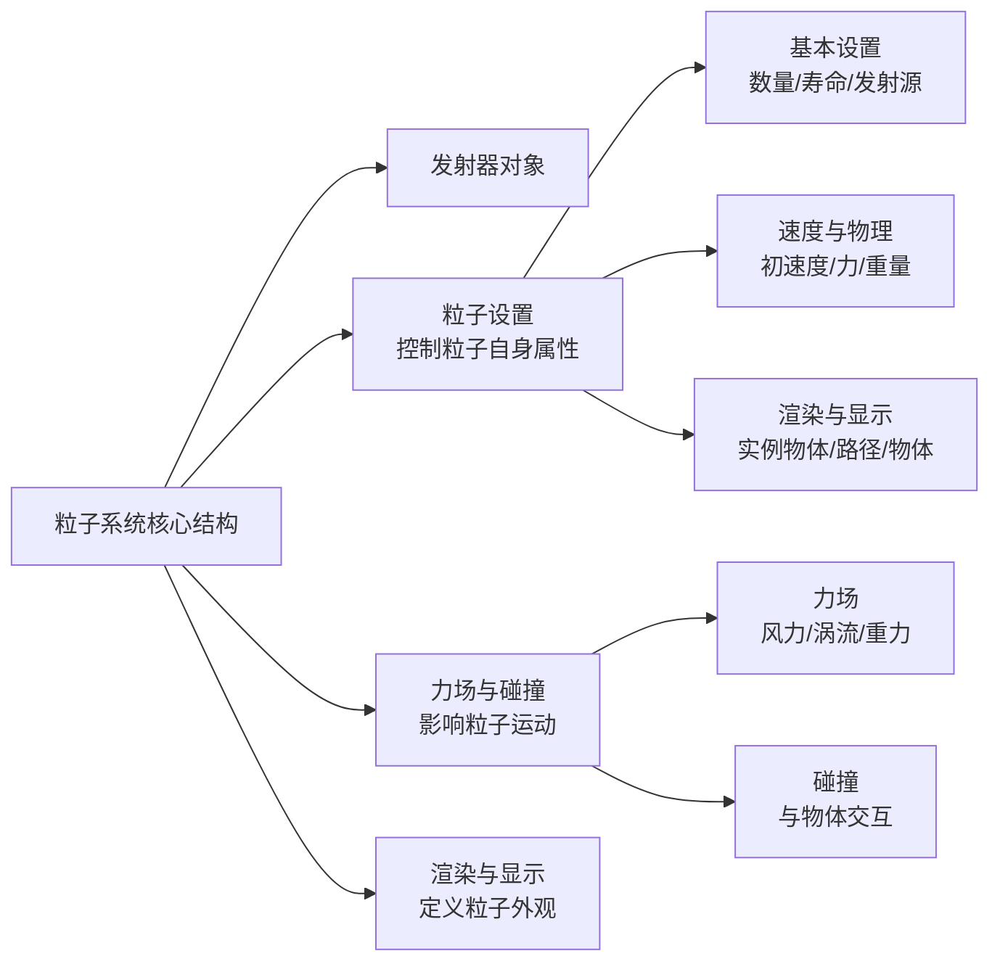

Blender 的粒子系统是一个强大且灵活的工具，用于模拟和生成大量相似对象（如雨、雪、火花、草地、毛发、人群等）的运动、外观和交互。它通过“发射器”生成粒子，并控制它们的寿命、速度、受力、渲染方式等。
以下是其核心概念、工作流程与关键设置的详解。
---
###  一、核心概念：粒子系统是什么？
粒子系统本质是一个**生成器**。它从一个或多个“发射器”对象表面生成大量微小的、可独立控制的元素（粒子）。每个粒子有自己的生命周期（出生、存在、死亡），并可以受到力、碰撞、场的影响。
**主要用途**：
*   **环境效果**：雨、雪、火花、落叶、萤火虫。
*   **自然元素**：草地、皮毛、羽毛、布料表面绒毛。
*   **视觉特效**：爆炸、烟、火、魔法光点。
*   **程序化分布**：快速在表面分布大量物体（如树木、岩石）。
---
###  二、核心组成与设置面板
粒子系统的设置分布在多个标签页中，理解其结构是关键。

#### 1. 发射器
这是**生成粒子**的对象。通常是一个网格（平面、球体等），粒子从其表面或顶点发射。在粒子设置中，你需要选择发射器对象。
#### 2. 粒子设置
这是配置粒子行为的核心区域，包含多个子标签页：
| 标签页 | 关键设置 | 说明 |
| :--- | :--- | :--- |
| **粒子** | 数量、寿命、发射源 | 定义粒子总数、存在时间，以及是从面、体积还是顶点发射。 |
| **速度** | 法向速度、对象速度、切向速度 | 控制粒子发射的初始速度和方向。 |
| **物理** | 质量、尺寸、力场设置 | 让粒子受重力、风力等影响，进行真实的物理模拟。 |
| **渲染** | 渲染为、实例物体 | 决定粒子是渲染成点、线、路径，还是作为另一个物体的实例。 |
| **显示** | 渲染时显示为 | 在视口中显示为点、线、物体等，方便预览而不影响最终渲染。 |
#### 3. 力场
为粒子系统添加外部影响，如风、涡流、磁力等。可以在粒子设置的“力场”部分添加和调整。
#### 4. 碰撞
使粒子能够与场景中的其他物体发生碰撞、反弹或粘附。需要在碰撞物体的物理属性中启用“碰撞”。
---
###  三、创建与配置基础粒子系统的流程
以创建一个简单的“火花”效果为例，说明基本步骤。
**步骤 1：创建发射器**
1.  在场景中添加一个平面（`Shift + A` -> 网格 -> 平面）。
2.  将其命名为“Emitter_Plane”。这将是火花发射的地方。
**步骤 2：添加粒子系统**
1.  选中发射器平面。
2.  在属性面板中，点击“粒子”图标。
3.  点击“+”号，添加一个新的粒子系统。
**步骤 3：基础设置（粒子标签）**
1.  **数量**：设置为 1000，表示总共产生 1000 个火花。
2.  **寿命**：设置为 50，表示每个火花持续 50 帧。
3.  **发射源**：选择“面”，并调整“随机性”使发射位置更自然。
**步骤 4：控制运动（速度与物理标签）**
1.  在“速度”标签下，调整“法向速度”为 2.0，让火花沿平面法线方向飞出。
2.  在“物理”标签下，启用“质量”，并设置一个较小的值（如 0.1），让火花受重力影响下落。
3.  添加一个“风力”力场，并调整其强度和方向，让火花随风飘动。
**步骤 5：调整外观（渲染与显示标签）**
1.  在“渲染”标签下，将“渲染为”设置为“路径”或“线”，可以产生拖尾效果。
2.  或者，勾选“实例物体”，并选择一个预先制作好的“火花”模型（如一个小立方体或发光点）作为粒子外观。
3.  在“显示”标签下，设置“渲染时显示为”为“点”或“线”，以便在视口中快速预览，而不必每次都渲染完整模型。
**步骤 6：测试与迭代**
1.  播放动画（`Alt + A`），观察粒子运动。
2.  根据需要调整速度、力场强度、寿命等参数，直到效果满意。
---
###  四、进阶应用：实例物体与毛发系统
粒子系统两个非常重要的应用是**实例物体**和**毛发**。
#### 1. 实例物体：程序化分布大量物体
这是快速创建森林、草地、人群等的经典方法。
*   **原理**：粒子系统作为“分布器”，将预先做好的物体（如一棵树）的实例分布在发射器表面。
*   **关键设置**：
    1.  准备一个用于分布的物体（如一个平面）作为发射器。
    2.  准备一个要被分布的物体（如一棵树），其原点最好位于底部。
    3.  在粒子设置的“渲染”标签下，勾选“实例物体”，并选择“树”这个物体。
    4.  调整“尺寸随机性”和“缩放”，使分布的树大小不一，更加自然。
#### 2. 毛发系统：创建皮毛、草地等
毛发系统是粒子系统的特殊模式，专门用于生成大量细长的、可梳理的线条。
*   **启用方式**：在粒子系统设置中，将“类型”从“发射体”改为“毛发”。
*   **特点**：
    *   粒子是静止的，不进行物理模拟（除非启用力场动态）。
    *   可以使用“粒子编辑模式”进行梳理、剪切、生长等造型操作。
    *   常用于角色头发、动物皮毛、地毯等。
---
###  五、优化与常见问题
1.  **性能考虑**：粒子数量过多（尤其是实例物体）会严重影响视图刷新和渲染速度。在视口中使用“显示”限制显示数量，或切换到“简化”视图显示。
2.  **渲染问题**：如果粒子不可见，检查：
    *   是否在渲染层中启用了粒子。
    *   是否选择了正确的“渲染为”方式（路径、物体等）。
    *   材质设置：毛发粒子通常需要专门的毛发材质或材质节点。
3.  **运动模糊**：为运动的粒子添加运动模糊，效果更真实。在渲染设置中启用“运动模糊”，并调整快门速度。
4.  **与物理系统结合**：要让粒子与刚体、软体等交互，需要启用“碰撞”并调整相关设置。
---
###  六、总结与学习建议
Blender 的粒子系统是一个从简单到复杂、功能全面的系统。建议的学习路径：
1.  **从基础发射体开始**：创建一个平面，添加粒子，调整数量、寿命、速度，理解基本参数。
2.  **学习实例物体**：用一个简单的立方体作为实例，制作一片“森林”，掌握分布和缩放技巧。
3.  **尝试毛发系统**：给一个球体添加毛发粒子，尝试梳理，制作一个简单的毛绒球。
4.  **探索力场与碰撞**：为粒子添加风场和碰撞平面，制作一个火花落地反弹的效果。
5.  **结合着色器**：学习为粒子赋予材质，例如制作发光的魔法粒子或透明的水滴。
通过以上步骤，你可以逐步掌握粒子系统的核心功能，并开始用它来丰富你的场景和特效创作。
