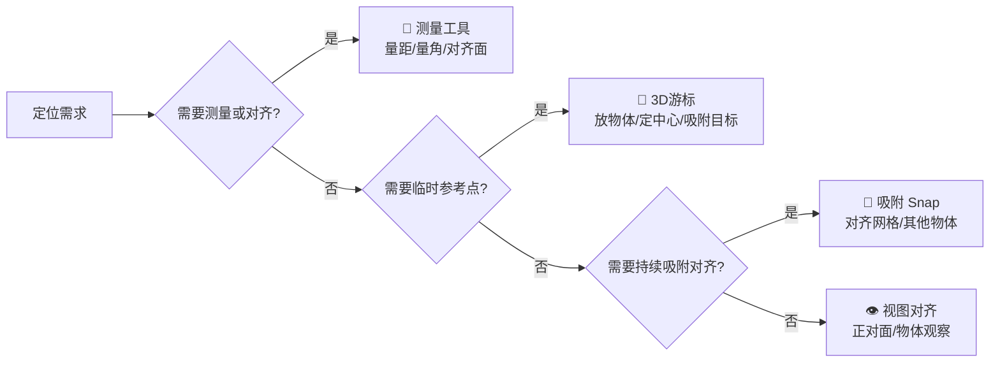

## 快捷键汇总

### 核心变换操作
这三个是物体模式下的“金刚键”，务必形成肌肉记忆。
| 操作 | 快捷键 | 说明与技巧 |
| :--- | :--- | :--- |
| **移动 (Grab)** | `G` | 按下后拖动鼠标移动物体。操作时可以：**按 `X`/`Y`/`Z`** 锁定到对应轴向移动；**再按一次 `X`/`Y`/`Z`** 切换到**局部坐标系**移动；按住 `Ctrl` 可临时开启吸附，按固定步长移动。 |
| **旋转 (Rotate)** | `R` | 操作逻辑同 `G`，**按 `X`/`Y`/`Z`** 锁定轴向旋转。**按住 `Ctrl`** 可以以15度增量旋转。 |
| **缩放 (Scale)** | `S` | 操作逻辑同 `G`，**按 `X`/`Y`/`Z`** 锁定轴向缩放。**按住 `Ctrl`** 可以以0.1增量缩放。 |
| **重置变换** | `Alt` + `G` / `S` / `R` | 分别重置物体的**位置**、**缩放**、**旋转**为默认值（0, 1, 0）。 |
> 💡 **小贴士**：在执行 `G`/`S`/`R` 操作时，你可以**直接输入数字**（如 `G X 5` 表示沿X轴移动5个单位），然后按回车确认，实现精确输入。
### 物体常用操作
这些操作让你对物体进行创建、复制、删除、隐藏等管理。
| 操作 | 快捷键 | 说明 |
| :--- | :--- | :--- |
| **添加物体** | `Shift` + `A` | 弹出添加菜单，可创建网格、曲线、灯光、相机等所有物体。 |
| **复制物体** | `Shift` + `D` | **关联复制**，复制的物体与原物体共享数据（如材质、修改器），修改其中一个另一个也会变化。 |
| **复制物体** | `Alt` + `D` | **关联复制**，功能同 `Shift`+`D`，为旧版快捷键，建议习惯 `Shift`+`D`。 |
| **删除物体** | `X` 或 `Delete` | `X` 会弹出确认菜单，`Delete` 直接删除（无确认）。 |
| **隐藏选中** | `H` | 隐藏选中的物体。 |
| **隐藏未选中** | `Shift` + `H` | 隐藏所有未选中的物体，只显示当前选中物体。 |
| **显示所有隐藏** | `Alt` + `H` | 显示所有被隐藏的物体。 |
| **合并物体** | `Ctrl` + `J` | 将多个选中的物体合并为一个物体（**物体模式**下）。 |
| **应用变换** | `Ctrl` + `A` | 弹出菜单，可将物体的缩放、旋转等“应用”为默认值，常用于重置物体尺寸。 |
### 视图与选择操作
高效的视角控制是流畅操作的前提，以下快捷键帮助你快速观察场景。
| 操作 | 快捷键 | 说明 |
| :--- | :--- | :--- |
| **旋转视图** | 按住鼠标中键拖动 | 这是环绕观察物体的主要方式。 |
| **平移视图** | `Shift` + 鼠标中键拖动 | 上下左右平移整个画布。 |
| **缩放视图** | 滚动鼠标中键滚轮 | 以鼠标光标为中心进行缩放。 |
| **视图切换** | 小键盘 `1`/`3`/`7` | 分别为**正视图**、**右视图**、**顶视图**。 |
| **透视/正交切换** | 小键盘 `5` | 切换透视投影和正交投影。 |
| **聚焦选中物体** | 小键盘 `.` | 将视图聚焦到选中的物体上。 |
| **摄像机视图** | 小键盘 `0` | 进入当前摄像机视角。 |
| **选择物体** | 鼠标左键 | 默认为左键选择，可在偏好设置中修改为右键选择。 |
| **全选** | `A` | 选择场景中所有物体。 |
| **取消全选** | `Alt` + `A` 或 `A` `A` | 快速按两次 `A` 也可实现取消全选。 |
| **框选** | `B` | 进入框选模式，拖动鼠标绘制选择框。 |
| **刷选** | `C` | 进入刷选模式，按住左键拖动选择经过的物体。 |
| **加选/减选** | `Shift` + 鼠标左键 | 按住 `Shift` 键点击可加选或减选物体。 |
###  模式切换
Blender的模式是工作流的核心，切换要快。
| 操作 | 快捷键 | 说明 |
| :--- | :--- | :--- |
| **切换物体/编辑模式** | `Tab` | 在**物体模式**和**编辑模式**之间切换。 |
| **模式选择饼菜单** | `Ctrl` + `Tab` | 弹出模式选择饼菜单，可快速切换到雕刻、纹理绘制等模式。 |

## “辅助定位”主要依靠**吸附（Snap）、3D游标、测量工具、视图对齐和物体原点**
---
### 一、吸附（Snap）—— 精准对齐的核心
吸附是Blender里最常用的定位辅助，能让物体或点自动“贴”到网格、其他物体或几何元素上。
#### 吸附开关与菜单
| 操作 | 快捷键/入口 | 说明 |
| :--- | :--- | :--- |
| **切换吸附开关** | `Shift + Tab` 或点击顶部磁铁图标 | 开启/关闭吸附功能。 |
| **临时吸附** | **按住 `Ctrl`** | 在变换（移动/旋转/缩放）时按住 `Ctrl`，可临时吸附；松开后取消吸附。 |
| **吸附设置菜单** | `Shift + Ctrl + Tab` 或顶部菜单 `Snapping` | 选择吸附目标（如增量、顶点、边、面等）和吸附方式。 |
#### 吸附目标（Snap To）常用选项
在吸附设置菜单里选择，决定吸附到什么上：
- **增量（Increment）**：吸附到网格交点。默认是“相对增量”，从物体起始位置开始计算；若要吸附到**视图网格**，需在吸附设置里开启 **Absolute Grid Snap**。
- **顶点（Vertex）**：吸附到最近的顶点。
- **边（Edge）**：吸附到最近的边。
- **面投影（Face Project）**：吸附到鼠标下的面。
- **体积（Volume）**：将物体吸附到另一物体内部（常用于骨骼放入模型）。
> 💡 **小技巧**：在变换过程中，按 `A` 可以标记多个吸附目标，最终会吸附到这些点的**平均位置**。
---
### 二、3D游标（3D Cursor）—— 万能参考点
3D游标是一个带位置和方向的参考点，常用于**放置新物体、作为旋转中心、吸附目标**等。
#### 游标放置与操作
| 操作 | 快捷键/入口 | 说明 |
| :--- | :--- | :--- |
| **快速放置游标** | `Shift + 右键` | 在任意视图快速放置游标，游标方向与当前视图方向对齐。 |
| **游标工具** | 左侧工具栏选择“Cursor”工具 | 工具栏里的游标工具，左键点击放置，工具设置里可调对齐方式（视图、表面、变换方向）。 |
| **游标吸附菜单** | `Shift + S` | 弹出菜单，可快速将游标吸附到选中项、世界原点、网格等，或将选中项吸附到游标。 |
#### 游标吸附菜单（`Shift + S`）常用命令
这是快速定位的黄金菜单：
- **Cursor to Selected**：将游标移动到选中物体/元素中心。
- **Cursor to World Origin**：游标归位世界原点。
- **Cursor to Grid**：将游标吸附到最近网格点。
- **Selection to Cursor**：将选中物体移动到游标位置（保持偏移）。
- **Selection to Grid**：将选中物体吸附到网格。
> 💡 **精准定位技巧**：在**正交视图**（如顶视图 `Num7`、前视图 `Num1`）中放置游标，可以同时控制两个轴的位置，深度在另一个视图中调整。
---
###  三、测量工具（Measure）—— 实时量距与对齐
测量工具可以画线量距离、角度，还能吸附到几何体上，辅助判断位置和尺寸。
| 操作 | 快捷键/入口 | 说明 |
| :--- | :--- | :--- |
| **激活测量工具** | 左侧工具栏选择 **“Measure”** | 在工具栏中点击标尺图标。 |
| **添加测量线** | `Ctrl + 左键` 拖动 | 创建一条测量线。 |
| **调整端点** | 左键拖动端点 | 拖动测量线端点进行重定位。 |
| **吸附到几何体** | 拖动时按住 `Ctrl` | 端点会吸附到顶点或边上。 |
| **测量壁厚** | 拖动时按住 `Shift` | 可测量平行面之间的距离（如墙壁厚度）。 |
| **删除测量线** | 选中后按 `Delete` 或 `X` | 删除当前测量线。 |
> ⚠️ **注意**：测量结果是**辅助显示**，不会出现在渲染输出中。
---
###  四、视图对齐 —— 从特定角度观察定位
有时你需要将视图“垂直”于某个面或物体，方便对齐和操作。
| 操作 | 快捷键 | 说明 |
| :--- | :--- | :--- |
| **对齐视图到活动元素** | `Shift + 小键盘方向键`（如 `Shift+Num7`） | 将视图对齐到**活动物体、骨骼或编辑模式下选中面的法向**。 |
| **菜单操作** | `View` → `Align View` → `Align View to Active` | 在菜单中选择对齐到物体的哪个轴。 |
| **锁定视图到活动物体** | `View Lock to Active` | 视图会跟随活动物体，始终居中显示。 |
> 💡 **典型场景**：在编辑模式下选中一个面，按 `Shift+Num7`，视图会立即正对该面，非常适合对齐操作。
---
### 五、物体原点（Object Origin）—— 变换的“轴心”
物体原点（小黄点）是物体旋转、缩放的中心，也是吸附的参考点之一。调整原点位置可以改变变换行为。
| 操作 | 入口/快捷键 | 说明 |
| :--- | :--- | :--- |
| **设置原点到几何中心** | 右键菜单 → `Set Origin` → `Origin to Geometry` | 将原点移至几何体中心。 |
| **设置原点到3D游标** | 右键菜单 → `Set Origin` → `Origin to 3D Cursor` | 将原点移至游标位置。 |
| **原点到选中项** | 编辑模式下选中点/边/面 → `Shift+S` → `Cursor to Selected` → 回到物体模式 → `Set Origin` → `Origin to 3D Cursor` | 通过游标间接将原点移至选中元素。 |
> 💡 **提示**：Blender 2.8 之后，设置原点默认**没有快捷键**，但可通过右键菜单或 `F3` 搜索“Set Origin”执行。
---
### 六、其他辅助定位功能
#### 1. 网格（Grid）
- 视图网格的尺寸可在 `场景属性` → `Units` 中调整。
- 在正交视图下，吸附增量会**根据缩放级别变化**，放大视图可使用更小的吸附步长。
#### 2. 变换方向（Transform Orientation）
- 可创建**自定义变换方向**（如对齐到某个面的法向），然后在吸附或变换时使用该方向，实现定向定位。
- 通过顶部变换方向菜单或 `热键`（如 `Alt + Space`）选择。
#### 3. 枢轴点（Pivot Point）
- 将枢轴点设为 **3D游标**，可以让旋转、缩放以游标为中心进行。
- 通过顶部枢轴点菜单或 `热键`（如 `Ctrl + .`）快速切换。
---
###  快速决策：该用哪个工具？
你可以根据下图快速判断该用哪种辅助定位工具：

##  在Blender建模中，**点（顶点）、线（边）、面**是构成模型的最基本元素。对它们的控制主要在**编辑模式**下进行。
###  一、进入与切换
首先，你需要进入编辑模式才能操作点线面。
| 操作 | 快捷键 | 说明 |
| :--- | :--- | :--- |
| **切换物体/编辑模式** | `Tab` | 在物体模式（整体移动）和编辑模式（修改结构）之间切换。 |
| **切换点/线/面模式** | `1` / `2` / `3` | 键盘上方数字键。`1`顶点，`2`边，`3`面。 |
| **全选/取消全选** | `A` / `Alt + A` | 编辑模式下同样适用，全选所有元素。 |
---
###  二、核心建模操作（高频使用）
这是建模过程中最常用的“雕刻”工具。
| 操作 | 快捷键 | 适用元素 | 说明与技巧 |
| :--- | :--- | :--- | :--- |
| **挤出** | `E` | 面/边 | 沿法向挤出新的几何体。**按 `Alt`+`E`** 可选“挤出流形”等更多方式。 |
| **内插面** | `I` | 面 | 在面内部创建缩小的同形状面。按 `Ctrl` 可深度控制。 |
| **倒角** | `Ctrl` + `B` | 点/边/面 | 拖动鼠标倒角，滚动滑轮调整段数。**点倒角**用 `Ctrl`+`Shift`+`B`。 |
| **环切** | `Ctrl` + `R` | 整体 | 在模型上添加环线。鼠标滚轮可增减切线，点击确认位置。 |
| **切割** | `K` | 整体 | 自由切割模型。按住 `Z` 可开启吸附切割。按 `Enter` 或 `Esc` 退出。 |
| **删除/融并** | `X` | 点/线/面 | **关键区别**：`删除`会留下洞；`融并`会移除元素并自动填补面。 |
> 💡 **点线面操作逻辑**：大多数操作（如挤出、倒角）会自动根据你当前的“点/线/面模式”智能判断。比如在线模式下按 `E`，就是挤出边线。
---
###  三、点线面的生成与合并（拓扑构建）
当你需要手动构建模型结构，或者修复破损模型时使用。
| 操作 | 快捷键 | 说明 |
| :--- | :--- | :--- |
| **填充面** | `F` | 选中3个以上的点/边，自动生成一个面填充。 |
| **合并** | `M` | 将选中的点合并到一个位置。常用于焊接顶点（选中2点 -> `M` -> `At Center`）。 |
| **断开** | `V` | 将选中的顶点/边断开，使网格分离。 |
| **连接路径** | `J` | 在两点之间连线并切割面（与 `F` 不同，`J` 会把面切成两半）。 |
| **桥接** | `Ctrl` + `E` | 选中两条边或两个面，生成过渡的连接面。 |
---
###  四、精准控制与调整
当模型形状基本出来后，需要微调位置。
| 操作 | 快捷键 | 说明 |
| :--- | :--- | :--- |
| **滑移** | `G` + `G` (双击G) | **点/线专用**。让点或线沿着原本的表面滑动，不会破坏模型结构。 |
| **法向缩放** | `Alt` + `S` | **面专用**。让面沿法向方向变胖或变瘦（类似挤出但不增加面）。 |
| **推拉** | `Shift` + `Space` -> 选择工具 | 让面在凹陷和凸起之间切换，常用于Hard Surface建模。 |
| **断离** | `Alt` + `D` | 复制并移动选中的元素（与物体模式的Shift+D不同）。 |
| **分离** | `P` | 将选中的点线面分离成一个独立的新物体。 |
---
###  五、选择技巧（点线面特有）
在编辑模式下，选择是效率的关键。
| 操作 | 快捷键 | 说明 |
| :--- | :--- | :--- |
| **循环选择** | `Alt` + `左键` | 点击边或面，自动选中整圈循环线。 |
| **加选/减选** | `Ctrl` + `+` / `-` | 选中一个点/面后，按此键向外扩展/收缩选择范围。 |
| **最短路径** | `Ctrl` + `左键` | 选中起点，按住Ctrl点终点，自动选中两点间最短路径。 |
| **选择循环线** | `Shift` + `Alt` + `左键` | 在面模式下，快速选中一排面（环行面）。 |
---
###  学习建议：理解拓扑逻辑
1.  **点控制结构**：顶点的位置决定了模型的轮廓。尽量保持四边面，顶点分布均匀。
2.  **线控制流向**：边线（尤其是环切线）决定了动画变形时的走向。在做表情动画时，眼嘴的布线尤其重要。
3.  **面控制表面**：面是渲染的表面。尽量减少三角面和N-gon（多边面），除非是硬表面或不可见区域。
建议先从简单的立方体开始，尝试用 `E`（挤出）、`Ctrl+R`（环切）、`I`（内插面）这三个键组合，制作一个甜甜圈或杯子，这能最快掌握点线面的感觉。
