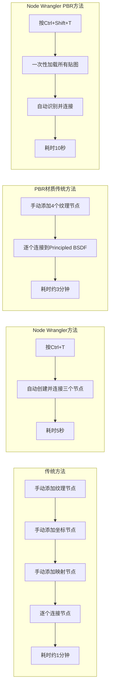

 **Node Wrangler** 是 Blender 内置的一个强大插件，堪称节点编辑的“效率神器”。它默认是开启的，但很多人不知道它的存在，更不知道它的强大功能。
简单来说，**Node Wrangler 让你的节点操作速度提升至少 3 倍**，特别是在做材质纹理时，能帮你节省大量时间。
---
###  一、它是谁？在哪里？
Node Wrangler 是 Blender 的**内置插件**，无需额外安装。
- **查看是否开启**：`编辑` → `首选项` → `插件` → 搜索 "Node Wrangler" → 确保已勾选。
- **适用场景**：着色器编辑器、合成编辑器、几何节点编辑器。其中在**着色器编辑器**用得最多。
---
###  二、核心功能与快捷键（必背）
下面是 Node Wrangler 最常用的功能，按场景分类。
#### 1. 快速添加与连接节点（最常用）
| 操作 | 快捷键 | 效果 | 应用场景 |
| :--- | :--- | :--- | :--- |
| **添加纹理并自动连接** | `Ctrl` + `T` | 自动添加 **Image Texture** + **Texture Coordinate** + **Mapping** 三个节点，并连好线。 | 加载图像纹理时的**标准起步动作**，一键完成“坐标-映射-纹理”的连接。 |
| **添加 Principled BSDF 纹理集** | `Ctrl` + `Shift` + `T` | 打开文件浏览器，一次性加载**多张贴图**（Base Color, Roughness, Normal 等），自动创建节点并连到 Principled BSDF。 | 制作 PBR 材质时的**终极神器**，一键完成整套材质连接。 |
| **添加节点并自动连接** | `Shift` + `A` → 选择节点 | 添加节点时，如果鼠标悬停在某节点上，新节点会**自动连接**到该节点。 | 快速插入节点，如添加 Mix 节点自动连接到输出。 |
> 💡 **Ctrl+T 和 Ctrl+Shift+T 是你必须掌握的两个快捷键**，它们能解决 80% 的纹理连接工作。
#### 2. 节点预览与调试（调试神器）
| 操作 | 快捷键 | 效果 |
| :--- | :--- | :--- |
| **预览节点输出** | `Ctrl` + `Shift` + `左键点击` | 自动创建一个 **Viewer (查看器) 节点** 并连接到点击的节点，在视图中实时预览该节点的输出（如颜色、灰度图）。 |
| **切换预览节点** | `Ctrl` + `Shift` + `左键点击` 其他节点 | 再次点击其他节点，预览会自动切换到新节点。 |
| **退出预览模式** | `Ctrl` + `Shift` + `左键点击` 空白区域 | 移除查看器节点，恢复原始连接。 |
这个功能让你能**逐个检查节点**的输出，快速发现哪个节点设置有问题，是调试复杂节点树的必备工具。
#### 3. 节点合并与混合（效率核心）
| 操作 | 快捷键 | 效果 |
| :--- | :--- | :--- |
| **快速混合节点** | `Ctrl` + `0` ~ `9` | 将选中的节点与一个 **MixRGB** 节点混合，数字键决定混合模式：`0`=Mix, `1`=Darken, `2`=Multiply, `3`=Color Burn... 等。 |
| **合并为节点组** | `Ctrl` + `G` | 将选中的节点打成一个**节点组**，方便复用和管理。 |
| **解散节点组** | `Alt` + `G` | 将节点组解散为独立节点。 |
> 💡 **快速混合节点** 是一个被低估的功能。比如，你想把两个纹理叠加，只需选中它们，按 `Ctrl+0`，就自动创建了一个 MixRGB 节点，省去了手动添加和连接的步骤。
#### 4. 节点整理与布局
| 操作 | 快捷键 | 效果 |
| :--- | :--- | :--- |
| **对齐节点** | `Alt` + `Y` | 将选中的节点按垂直方向对齐。 |
| **展开/折叠节点组** | `Tab` | 在节点组内部和外部之间切换。 |
| **静音节点** | `Alt` + `M` | 将节点“静音”，暂时断开其输入输出，用于测试。 |
#### 5. 连接管理
| 操作 | 快捷键 | 效果 |
| :--- | :--- | :--- |
| **断开节点连接** | `Alt` + `D` | 断开选中节点的所有连接。 |
| **重新连接节点** | `Alt` + `R` | 尝试自动重新连接节点到合适的输入输出。 |
---
###  三、实际应用案例：加速材质制作
#### 案例 1：快速创建 PBR 材质
假设你有一套 PBR 贴图（Base Color, Roughness, Normal, Metallic），通常做法是手动添加四个 Image Texture 节点并逐个连接，非常耗时。
**使用 Node Wrangler 的方法**：
1. 在着色器编辑器中，确保 Principled BSDF 节点已存在。
2. 按 `Ctrl` + `Shift` + `T`。
3. 在文件浏览器中，**一次性选中所有贴图文件**（可以多选）。
4. 点击“确认图像纹理”。
Node Wrangler 会**自动识别**贴图类型（Base Color, Roughness 等），并自动连接到 Principled BSDF 的对应输入。整个过程只需 5 秒。
#### 案例 2：调试复杂的程序纹理
假设你有一个由 Noise、Voronoi、Color Ramp 组成的复杂程序纹理，但结果不对。
**使用 Node Wrangler 的方法**：
1. 按 `Ctrl` + `Shift` + `左键点击` Noise Texture 节点，查看其输出。
2. 再点击 Voronoi Texture 节点，查看其输出。
3. 再点击 Color Ramp 节点，查看其输出。
这样你就能**逐级排查**，快速定位问题节点。
#### 案例 3：叠加两个纹理
假设你想将一个 Noise 纹理叠加到一个 Image Texture 上。
**使用 Node Wrangler 的方法**：
1. 同时选中 Image Texture 和 Noise Texture 节点。
2. 按 `Ctrl` + `0`（Mix 混合模式）。
3. 自动创建一个 MixRGB 节点，两个纹理已连接到 Color1 和 Color2。
4. 调整 Fac 参数控制混合程度。
这比手动添加 MixRGB 节点并连接节省了 3-4 次点击。
---
###  四、Node Wrangler 工作流对比

---
###  五、总结与建议
Node Wrangler 是 Blender 节点编辑的“瑞士军刀”，如果你经常用着色器编辑器或几何节点，它几乎是**必装且必学**的插件。
**建议的学习路径**：
1.  **先掌握 `Ctrl+T`**：这是最常用的功能，用于快速添加纹理并连接坐标。
2.  **再掌握 `Ctrl+Shift+T`**：用于快速加载 PBR 纹理集。
3.  **然后掌握 `Ctrl+Shift+左键点击`**：用于调试节点树。
4.  **最后尝试 `Ctrl+数字键`**：用于快速混合节点。
掌握了 Node Wrangler，你会发现制作材质和纹理的过程变得异常流畅，原本繁琐的连接工作变成了几次点击的事。这将极大地提升你的创作效率和心情！
