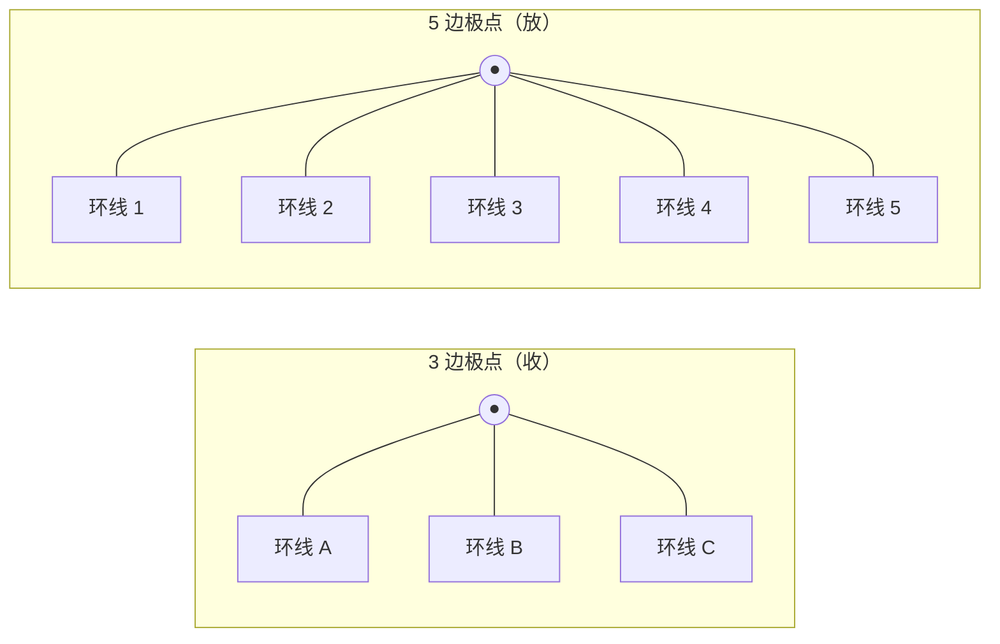
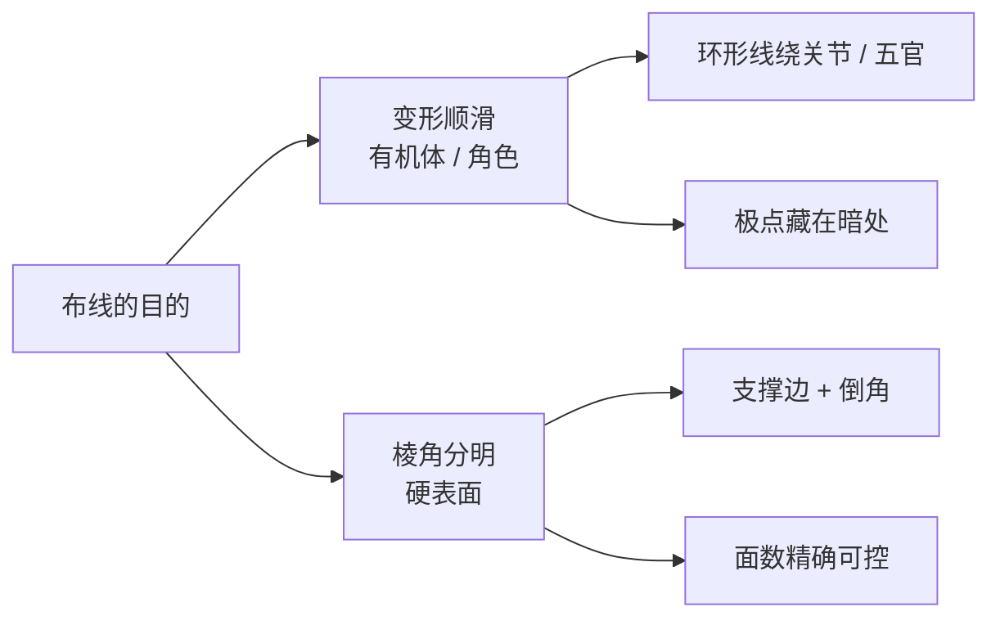

# 🧵 布线详解 —— 拓扑的实战课

> **前置阅读**：[《拓扑》](../01-基础概念/02-拓扑.md)（理论篇）
> 那篇讲「什么是好拓扑」，这一篇讲「手怎么动」：**工具、手法、流程**。
> 适用版本：Blender 4.x（快捷键可能随版本变化）。

## 一、布线到底布什么？

一句话：**决定网格里的「边」往哪走。**

如果把模型比作城市：

- **拓扑**是城市规划图——哪里是主干道、哪里是环路（规则）；
- **布线**是具体施工——每一条路（边）画在哪里、怎么拐弯（执行）。

对零基础来说，不用被「布线」这个词吓到。你打开 Blender 编辑模式看到的那些线，就是布线。学习布线，本质上是学习**怎么安排这些线，让模型在变形和渲染时表现更好**。

## 二、三块基本积木

| 积木 | 是什么 | 在布线中的作用 |
| :--- | :--- | :--- |
| **环形线**（Edge Loop） | 首尾相接、绕一整圈的一串边 | 绕在关节、眼睛、嘴巴周围，把变形「圈」在固定位置 |
| **极点**（Pole） | 一个点连了 **3 条** 或 **5 条** 边的位置 | 布线「刹车、转弯、加减环」的枢纽 |
| **三角面 / 多边形**（Tri / Ngon） | 3 条边 / 5 条边以上的面 | 尽量避免，小范围、藏在角落时勉强可用 |

### 极点是最关键的概念

四边面网格里，边的数量总得从多变少、从少变多，转弯也得有节点，这个「中转站」就是极点。它有两种性格：

- **3 边极点 =「收」**：几条环线在这里合并成一条（减环时用到）；
- **5 边极点 =「放」**：一条环线在这里拆成几条（需要更多细节时用到）。

> ⭐ **口诀**：极点藏进「变形少、不显眼」的地方——眼窝深处、嘴角后方、腋下、膝盖内侧。它们不是不能有，而是不能被看到。

### 为什么「四边面为主」是底线？——细分的原理

Blender 的表面细分（Subdivision Surface）用的是 **Catmull-Clark 算法**：它把每个面切开、再平滑顶点。关键是它对不同面型的「态度」完全不同：

- **四边形**：切成 4 个规整的小四边形，网格的「织法」不变，环线还能一路走下去；
- **三角形**：面中心会炸出一朵「星形」——生成一个连 3 条边的极点；
- **多边形（Ngon）**：同理，中心生成一个连 5+ 条边的极点。

极点周围顶点密度不均、法线方向突变，细分一上、灯光一打，这里就会出现**星形皱褶（Pinching）**——像有人在你模型表面捏了一把。所以「四边面为主」不是洁癖，而是让细分算法**按你预期的方式工作**。

> 💡 **一句话原理**：细分只会放大已有的问题。三角面/多边形不是当场报错，而是每细分一次，就在表面「长歪」一点。

## 三、好布线的三个目标

1. **边顺着变形方向走**：胳膊弯曲的地方，环线要一圈圈绕在关节处，这样褶皱才会集中在环线内，而不是散得到处都是。
2. **尽量保持四边面**：四边形在细分和变形时最稳定。三角面扎堆会让细分后出现奇怪的凹痕。
3. **极点藏起来**：做不到「零极点」，但能做到「看不见的极点」。

### 为什么环线能「兜住」变形？——铰链原理

网格弯折时，变形是**沿边发生**的：相邻两个面绕公共边旋转，这条边就像一扇门的**铰链（Hinge）**。

- 环线等于给铰链**排队**：一圈圈绕在关节上，弯折就有足够多的边来分摊，动作顺滑；
- 环线绕错方向或太少：弯折挤在仅有的几条边上，折痕集中、甚至穿帮——角色手肘最常见的「纸团褶皱」就是这么来的；
- **密度决定手感**：环线越密，变形摊得越开、越柔和；越疏，折痕越集中、越锐利。手指、手肘、肩这些活动多的地方要加环线，就是这个道理。

## 四、Blender 布线工具速查表

| 工具 | 快捷键 | 一句话用途 |
| :--- | :--- | :--- |
| **环切**（Loop Cut） | `Ctrl + R` | 加一圈环线，布线最常用的入口 |
| **切刀**（Knife） | `K` | 在任意位置切边，专治三角区、局部补线 |
| **连接顶点** | `J` | 两个顶点连一条边，并切分经过的面 |
| **填充**（Fill） | `F` | 选中边/顶点后封洞成面 |
| **挤出**（Extrude） | `E` | 沿方向拉出新的面/边 |
| **滑动**（Slide） | `G` 后按 `G` | 让边/顶点沿表面滑动，只动位置不改结构 |
| **合并**（Merge） | `M` | 把多个顶点并成一个 |
| **倒角**（Bevel） | `Ctrl + B` | 给边做斜面/圆角，硬表面的灵魂 |
| **溶解**（Dissolve） | `X` → 溶解边 | 去掉边但不留破洞（减环靠它） |
| **环选** | `Alt + 点选边` | 一键选中整圈环形线 |
| **双环选**（Ring） | `Ctrl + Alt + 点选` | 选中垂直于环线的另一串边 |
| **多边形建**（Poly Build） | 工具架 / 空格搜索 | 重拓扑时在表面「手绘」网格的主力 |
| **磁吸**（Snap） | `Shift + Tab` | 让新顶点吸到别的物体表面 |

> ⚠️ **注意**：环切在有三角面或多边形的地方会切不动、或只切一半。遇到这种情况，先用「选择 → 按特征 → 面边数」筛出异常面，用切刀（`K`）或连接（`J`）手动补线。

## 五、布线「语法」：三种基本功

### 1. 加环线

- 按 `Ctrl + R`，移动鼠标找到位置，左键确认；
- `Ctrl + R` 后直接按数字（如 `3`），可以一次加多圈，再拖动调整间距。

### 2. 减环线（4 条变 3 条）

环线不是越多越好，多余的线会让模型又乱又难改。把它们「收」起来：

1. 选中那条要收掉的**边**（不是整圈，是一小段过渡）；
2. 按 `X` 选择**溶解边**（Dissolve），不是删除！
3. 交点位置自然形成一个 **3 边极点**，环线从 4 条合并为 3 条。

> 💡 **为什么用「溶解」不用「删除」**：删除会直接抠出一个洞；溶解是「把这条边悄悄融掉」，周围面自动重新连好，不留破洞。
>
> 📐 **一条拓扑守恒律**：环线要么首尾闭合绕成一圈，要么**必须终结在极点或边界上**——它不可能凭空消失。想减少环线，就靠 3 边极点把两条「并」成一条；想增加，就靠 5 边极点「分叉」。这跟车道并入匝道是同一个道理：车流不会凭空消失，只能在路口汇流。

### 3. 让环线转弯

环线要改变方向时，**不能**让边硬生生直角拐弯（会出现拉伸褶皱），而是在极点处平滑「折」过去。

- 例：眉弓的**横**环线，要在眼角附近用极点过渡，变成绕眼眶的**竖**环线；
- 判断标准：弯曲的地方环线密度够不够、变形时有没有「撕扯感」。

## 六、重拓扑实战流程（Blender 4.x）

场景：雕刻完成的高模 → 在表面重新描一层规整的低面数网格。

1. **准备**：把雕刻高模放到一旁（可以隐藏显示，只留作参考）；
2. **两种起手式**（任选其一）：
   - 新建一个球体/平面当低模起点，加上 **收缩包装（Shrinkwrap）** 修改器，投影到高模表面；
   - 更常用：直接在编辑模式里把**磁吸（`Shift + Tab`）**打开，吸附方式选「**投影到面（Face Project）**」，这样画的每个点都自动贴在高模表面；
3. **开描**：用 **多边形建（Poly Build）** 从一个位置开始，沿表面一圈圈铺四边面；局部密集细节用环切 + 挤出逐步搭；
4. **守规矩**：全程保持四边面，极点放进眼窝、嘴角、腋下、膝盖内侧；
5. **检查**：用「选择 → 按特征 → 面边数」筛出三角面/多边形，逐个修掉；打开视口右上角的**统计（Statistics）**看面数是否可控；
6. **预览**：加一层**表面细分（Subdivision Surface）**修改器，旋转模型检查有没有凹痕、收缩或褶皱，发现问题就回到布线层调整。

> ⭐ **提醒**：高模如果后来又改了，记得检查 Shrinkwrap 的投影方向是否还正确，必要时重新应用或重建磁吸。
>
> 🔄 **为什么重拓扑要重成「低模」？** 高模细节多但面数高，动不了也带不动。规范流程是：**高模负责细节，低模负责动画**，再把高模表面细节**烘焙**成法线贴图贴到低模上（对应目录：`08-UV与烘焙`）。所以低模布线越干净，后续绑定、动画、进引擎越省心。

## 七、硬表面 vs 有机体

| 维度 | 硬表面（机械、道具） | 有机体（角色、生物） |
| :--- | :--- | :--- |
| 关注点 | 棱角分明、支撑边、倒角 | 变形顺滑、关节环线 |
| 极点 | 也讲究，可藏在非关键边 | 必须藏进变形小、不显眼处 |
| 常用手法 | 环切、倒角、布尔后清理 | Poly Build、环形线、雕刻后重拓扑 |
| 面数 | 精确、可控 | 够用前提下尽量低 |

### 支撑边（Supporting Edge）的原理

硬表面要「棱角分明」，但细分天生爱「磨圆」。解决思路不是禁用细分，而是**用环线把棱角夹住**。

细分时，每段边都会被插值出新的顶点。**紧贴锐角两侧的支撑边**会把新顶点「钉」在角附近，让过渡在很小的范围内完成——这就是棱角能保住的原理。

#### 关键参数①：支撑边的数量 = 棱角的锐度

| 支撑边数量 | 细分后的效果 | 典型用途 |
| :--- | :--- | :--- |
| 0 条 | 角落被圆滑成弧面 | 有机体、圆角造型 |
| 1 条 | 像磨了一道斜边（Chamfer） | 轻度倒角 |
| 2 条 | 锐利棱角（最常用） | 机械、枪械、外壳 |
| 3 条 | 更硬，棱角两侧留出小段平面 | 高光反差大的硬边 |

**关键参数②：支撑边到棱角的距离**——越近，角越锐、过渡越集中；越远，角越圆。细分级别越高，需要的支撑边通常也越多。

## 八、踩坑记录

1. **环切切不动** → 附近有三角面/多边形。先筛出来修掉，或用切刀 `K` 手动切。
2. **减环用了「删除」** → 留下一个洞。要用 `X` → **溶解边**。
3. **重拓扑忘了开磁吸** → 顶点飘在表面外，布线全乱。`Shift + Tab` 打开，并选「投影到面」。
4. **极点放在肘关节内侧** → 一弯手臂就起包。放关节**两侧**，让环线整体绕在关节上。
5. **迷信「零极点」** → 四边面网格必然有极点。目标是藏好，不是消灭。
6. **减环后出现超大三角面** → 过渡太急。用 `J` 连接斜向顶点，把三角面切成多个小块平滑过渡。
7. **高模改了但 Shrinkwrap 不更新** → 检查投影方向，必要时重建投影。

## 九、怎么练（给零基础）

- **练习 1**：接理论课的球体练习——在球体上切出绕「眼睛」和「嘴」的环线，感受极点怎么布置；
- **练习 2**：在 Cube 上做减环，把 4 条竖线收成 3 条，熟练「溶解 + 极点」；
- **练习 3**：找一个简单头雕/手部高模做重拓扑，练熟 Poly Build + 磁吸的组合，这也是以后做角色的核心流程。

每练完一个，存一份 `.blend` 文件、截一张图，放进 `10-项目实战` 对应的项目里——既是记录，也是以后回看的素材。

## 参考链接

- Blender 官方手册（中文）：<https://docs.blender.org/manual/zh-hans/latest/>
- Blender 官方手册 · 网格建模章节（英文）：<https://docs.blender.org/manual/en/latest/modeling/meshes/>
- 需要查具体工具时，在手册里搜：**Loop Cut**（环切）、**Knife**（切刀）、**Poly Build**（多边形建）、**Shrinkwrap**（收缩包装）。
